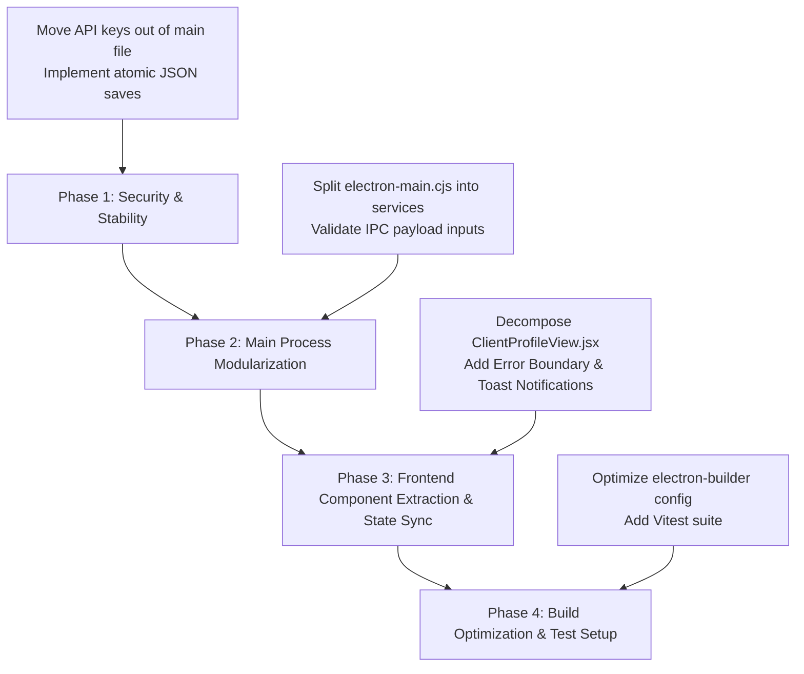

# Beetsma Consultancy CRM — Architecture & Development Journal

> **Last Updated:** August 14, 2026  
> **Status:** Initial Codebase Audit & Improvement Strategy  
> **Target App:** Beetsma Consultancy CRM (Electron + React + Vite)

---

## Executive Summary

The **Beetsma Consultancy CRM** is a feature-rich desktop CRM tailored for financial consultants. It includes client profile management, sales pipelines, product analysis, Google Calendar sync, Project 100 contact tracking, and Gemini AI dossier generation/briefings.

While feature-complete for core workflows, the codebase has accumulated technical debt that impacts performance, maintainability, security, and scalability. This journal documents the current state, identifies key areas for improvement, and establishes a clear roadmap for refactoring.

---

## Key Findings & Improvement Areas

### 1. 🔒 Security & Credential Management (High Priority)
- **Hardcoded Gemini API Key**: `electron-main.cjs` (Line 9) hardcodes an active Google Gemini API key (`GEMINI_API_KEY`).
  - *Risk*: Exposes secret credentials in source control and compiled bundles.
  - *Recommendation*: Move API keys to an environment variable (`.env`) or store securely using Electron's `safeStorage` API with an in-app Settings modal for key configuration.

### 2. 🗄️ Persistence Layer & Data Integrity (High Priority)
- **Synchronous JSON File Persistence (`crm_data.json`)**:
  - `saveDatabase()` in `electron-main.cjs` performs `fs.writeFileSync()` on every single data change.
  - *Issues*:
    - **Main Process Blocking**: Synchronous JSON serialization blocks the Node.js event loop on the main thread, causing UI freezes as dataset grows.
    - **Data Corruption Vulnerability**: Direct `writeFileSync` to the primary DB file risks corrupting data if the app is force-closed or crashes mid-write.
  - *Recommendation*:
    1. Implement **atomic file writes** immediately (`write to temp file` + `fs.renameSync`).
    2. Migrate to an embedded database like **`better-sqlite3`** or **IndexedDB / RxDB** for indexed queries, transactions, and background persistence.

### 3. 🧩 Monolithic Code Organization & Maintainability (Medium-High Priority)
- **Main Process Monolith (`electron-main.cjs` ~2,400 lines / ~100 KB)**:
  - Combines IPC routing, JSON file IO, Google OAuth 2.0 flows, Puppeteer web scrapers, and Gemini API calls into a single file.
  - *Recommendation*: Refactor into modular services:
    - `src/main/services/db.js` — Database access layer
    - `src/main/services/gemini.js` — AI integration & briefing service
    - `src/main/services/googleCalendar.js` — Google OAuth & Calendar sync
    - `src/main/services/socialScraper.js` — Puppeteer & browser automation
    - `src/main/ipc/` — Isolated IPC event handlers

- **React View Monoliths (`src/views/`)**:
  - `ClientProfileView.jsx`: ~125 KB (~3,000+ lines in a single file)
  - `Project100Detail.jsx`: ~90 KB (~2,000+ lines)
  - `ScheduleView.jsx`: ~67 KB
  - `SpecialReportsView.jsx`: ~63 KB
  - *Recommendation*: Extract UI sub-components (Modals, Dossier Cards, Timeline items, Form sections, Data tables) into reusable modules under `src/components/`.

### 4. ⚡ Packaging & Installer Optimization (Medium Priority)
- **`electron-builder` Configuration (`package.json`)**:
  - `package.json` includes `"node_modules/**/*"` in the packaged application files.
  - *Issue*: Bundles developer tools (`vite`, `eslint`, `electron-builder`, etc.) into the production desktop installer, inflating file size by hundreds of MBs.
  - *Recommendation*: Remove `"node_modules/**/*"` from `build.files` since Vite bundles frontend assets and production runtime dependencies into `dist/`.

### 5. 🔄 Global State & Inter-View Data Synchronization (Medium Priority)
- **Isolated Local State**:
  - Views like `DashboardView`, `PipelineView`, and `ClientsView` fetch data on `useEffect` mount independently via IPC calls.
  - *Issue*: Modifying a client or pipeline item in one tab does not update other tabs automatically until manually refreshed or re-mounted.
  - *Recommendation*: Implement a global state store (e.g., `Zustand` or React Context) with IPC event listeners (`ipcRenderer.on('db-updated')`) to keep all open views real-time synchronized.

### 6. 🛡️ Resilience & UX (Medium Priority)
- **Missing React Error Boundaries**:
  - No `<ErrorBoundary>` wrapper in `App.jsx`. Unhandled UI render exceptions will crash the renderer to a blank white screen.
- **Form Validation & Toast Notifications**:
  - User feedback for background IPC operations (e.g., calendar sync, AI enrichment failures) lacks toast notification alerts.

### 7. 🧪 Automated Testing Strategy (Future Enhancement)
- No test runner or test suites currently set up.
- *Recommendation*: Introduce **Vitest** for component/unit tests and **Playwright / Spectron** for E2E Electron testing.

---

## Recommended Refactoring Roadmap

---

## Feature Release: Client Financial Planning & Dynamic Life Event Simulator (August 2026)

### Summary of Completed Architecture & Capabilities
1. **Dedicated Workspace (`ClientFinancialPlanView.jsx`)**:
   - Launched from `ClientProfileView.jsx` with quick KPI preview card and top-level header action.
   - Includes real-time Net Worth & Cash Flow Balance Sheet, Capital Accumulation & Decumulation Runway Graph (Ages 25–90+), Auto-Aggregated Insurance Protection Gap Matrix, Dynamic Life Event Stress-Testing Simulator, and Gemini AI Advisory Action Plan.
2. **Interactive Lifetime Projection Engine**:
   - Compounds liquid and invested assets with annual savings in pre-retirement, transitioning into inflation-adjusted decumulation during retirement with annuity/CPF Life offsets.
   - Renders interactive multi-curve SVG chart with visual retirement gate and capital depletion markers.
3. **Insurance Protection Matrix**:
   - Auto-aggregates in-force policies from `crm_data.json` for Death, TPD, Early CI, Major CI, Hospital Shield, and Disability Income against 10x/4x/2x income benchmarks.
4. **'What-If' Stress-Testing Engine**:
   - Interactive presets for Property Upgrade, Critical Illness Shock, Child University Fund, Pre-Retirement Market Shock (-30%), Total Permanent Disability, and Sabbatical with insurance claim offsets.
5. **IPC Endpoints**:
   - `save-client-financial-plan`: Persists complete plan state to client record.
   - `generate-financial-plan-ai-summary`: Uses Gemini AI with structured schema to generate executive summary, readiness score, key strengths, risk gaps, and consultative talking points.

---

## Feature Release: Client Claims Management & Payout Reconciliation Engine (August 2026)

### Summary of Completed Architecture & Capabilities
1. **Client Claims Hub (`src/components/ClientClaimsSection.jsx`)**:
   - Integrated into `ClientProfileView.jsx` beneath the Policy Portfolio.
   - Real-time aggregate metric counters: Active claims alert, total reimbursed benefits, total incurred bills, and claim reconciliation health pills.
   - Expandable claim cards with provider & policy linkages, stage progression indicators, itemized bill counts, and physical vault file counts.
2. **4-Tab 3-Step Claim Lifecycle Workspace (`src/components/ClaimModal.jsx`)**:
   - **Step 1 (Claim Event Details Tab)**: Defines the overarching claims event (Hospitalisation, CI, Accident, Disability, Death), dates, hospital/clinic, doctor, and links to in-force policies.
   - **Step 2 (Tagged Bills Ledger Tab)**: Dedicated ledger to tag individual clinic and hospital bills/receipts as they arrive (pre-admission MRI, surgery bill, follow-up physio), with attached local receipt files and submission status tracking.
   - **Step 3 (Settlement & Reconciliation Tab)**: Logs Insurer Settlement Statements and EOB letters; live formula automatically audits:
     $$\text{Total Incurred Bills} - (\text{Insurer Paid} + \text{Client Co-Pay / Deductible} + \text{Medisave}) = \text{Unaccounted Variance}$$
     Instantly confirms full settlement ($0 variance) or alerts to unpaid bills/shortfalls.
   - **Step 4 (Document Vault & Notes Tab)**: Centralized repository of medical reports, claim forms, local file viewer (`openPath`), and case progression timeline.
3. **Gemini AI Claim Copilot (`src/components/ClaimAiAssistantModal.jsx`)**:
   - **Mode 1 (Settlement & Bill Reconciliation Audit)**: Cross-examines clinic combined bills against settlement letters and submission summaries to detect unpaid line-items or explain deduction codes.
   - **Mode 2 (Client WhatsApp / SMS Update Generator)**: Drafts compassionate, transparent mobile-ready settlement breakdowns for the client with one-click copy.
   - **Mode 3 (Official Insurer Cover Letter / Appeal Drafter)**: Generates formal letters citing policy numbers, itemized invoices, and clinical justifications.
4. **IPC Endpoints**:
   - `get-claims`, `get-all-claims`, `add-claim`, `update-claim`, `delete-claim`
   - `attach-claim-document`, `open-claim-folder`, `delete-claim-file`
   - `analyse-claim-settlement-reconciliation`, `generate-claim-ai-assist`

---

## Feature Release: CRM Core Enhancements & Claims Quality Suite (August 19, 2026)

### Summary of Completed Improvements (From Consultant Notes)
1. **Claims Section Warnings & Attention Alerts (`src/components/ClientClaimsSection.jsx`)**:
   - Added prominent alert notification banners when active claims require insurer follow-ups (`Information Required`) or have unaccounted reconciliation variances / shortfalls.
   - Enhanced claim card pills to clearly highlight shortfalls and pending bills.
2. **Client Company & Job Title Editing (`src/views/ClientProfileView.jsx`, `src/views/ClientsView.jsx`)**:
   - Added `companyName` and `jobTitle` inputs to both the **Add New Client** modal and the **Edit Client Profile** modal.
   - Updated profile view to immediately re-render edited corporate details.
3. **Clear System Logs (`electron-main.cjs`, `electron-preload.cjs`, `src/components/Sidebar.jsx`)**:
   - Added `clear-log-file` IPC handler and exposed `clearLogFile` in preload.
   - Added a "Clear" button in the Sidebar next to "View Logs" with confirmation and transient feedback.
4. **Enhanced Glassmorphic DatePicker Component (`src/components/DatePicker.jsx`)**:
   - Built a custom, dark-mode native date picker featuring direct **Month** and **Year** dropdown selectors (covering 1920 to 2060 for instant DOB and policy year selection), fast previous/next year chevrons (`<<` and `>>`), fast previous/next month chevrons (`<` and `>`), quick presets (*Today*, *Tomorrow*, *+1 Wk*, *+1 Mo*, *+1 Yr*), and click-outside dismissal.
   - Replaced native date inputs across Task creation, Client DOB, Policy inception dates, Claim incident/admission/discharge/bill/settlement dates, Pipeline, and Campaign milestones.
5. **Integrated Shield Plans MediSave & Cash Outlay Breakdown & 2-Decimal-Place Precision (`src/views/ClientProfileView.jsx`)**:
   - In Policy creation/editing, when plan type is `Shield`, consultant can enter separate MediSave (CPF) and Cash Outlay amounts.
   - All premium and coverage inputs accept decimal values with `step="0.01"` and `min="0"`.
   - Updated `formatCurrency` to dynamically format with 2 decimal places whenever cents are present.
   - Displays MediSave and Cash split in both Policy Card and Horizontal List views.
6. **Horizontal Table / Cards View Switcher (`src/views/ClientProfileView.jsx`)**:
   - Added a View Mode toggle (**Cards** vs. **Horizontal List Table**) for the Policy Portfolio.
   - The table view provides a high-density, horizontal overview of policy status, provider, type, number, premium/split, inception anniversary, coverage pills, and quick edit actions.
7. **Renamed Navigation / Section Label (`src/views/ClientProfileView.jsx`)**:
   - Updated the section header from `Tasks & Follow-ups` to `Tasks/Meetings/Follow-ups`.

---

## Feature Release: OneMap SG Address Autocomplete, Policy Remarks & 'Others' Coverage (August 20, 2026)

### Summary of Completed Improvements
1. **OneMap SG Address Autocomplete (`src/components/AddressAutocomplete.jsx`)**:
   - Integrated Singapore Land Authority's official OneMap Elastic Search API for instant 6-digit postal code (e.g., `048581`), building name, and street name resolution.
   - Built a sleek glassmorphic dropdown with debouncing (250ms), keyboard navigation (Up/Down/Enter/Escape), click-outside dismissal, clear button, and freeform manual typing fallback for unit numbers (`#12-34`) and international addresses.
   - Integrated across:
     - **Client Profile**: Edit Client Profile modal & Task/Meeting creation location (`ClientProfileView.jsx`).
     - **Client Hub**: Add New Client modal (`ClientsView.jsx`).
     - **Schedule & Calendar**: Quick Add Task & Edit Event/Meeting location modals (`ScheduleView.jsx`).
2. **Policy Remarks & Special Notes Box (`src/views/ClientProfileView.jsx`, `electron-main.cjs`)**:
   - Added a multi-line Remarks textarea to the Policy Modal for capturing unique rider terms, nomination status, exclusions, and subset coverage clauses.
   - Rendered Remarks callout box in Policy Cards View and inline remarks preview with hover tooltips in Horizontal Table View.
   - Handled persistence and backward compatibility in `add-policy` and `update-policy` in `electron-main.cjs`.
3. **'Others' Coverage for Unique/Subset Plan Types (`src/views/ClientProfileView.jsx`)**:
   - Added `'Others'` to `COVERAGE_MAP` across all policy types (`Life`, `Term`, `A&H`, `Shield`, `HI`, `ILP`, `Endowment`, `LTC`, `Disability Income`).
   - Enabled advisors to specify custom coverage amounts with 2-decimal precision, rendered dynamically in Policy Cards, Horizontal Table, and Profile Overview.

---

## Feature Release: Financial Blueprint Blank Slate Architecture (August 20, 2026)

### Summary of Completed Improvements
1. **True Blank Slate Initialization (`src/views/ClientFinancialPlanView.jsx`)**:
   - Removed all hardcoded mock/placeholder numbers (`$8,500` earned income, `$65,000` liquid cash, `$140,000` invested assets, mock university/property upgrade goals).
   - A client with no saved financial blueprint now starts with a clean blank state (`''`, `$0`, and empty milestone goals `[]`).
   - Derived metrics, emergency months, savings rate, protection health score, and lifetime accumulation runway gracefully handle empty or zero-value states without `NaN` or division-by-zero errors.
2. **Dynamic Life Event Customization**:
   - Clean life event templates start deactivated (`active: false`) with $0 outlay and $0 monthly impact.
   - Added direct numeric inputs for **Lump Sum Outlay ($)** and **Monthly Impact ($/mo)** on event cards so consultants can configure exact client-specific scenarios.
3. **Empty Slate Visual Guidance & Chart Grace**:
   - Added friendly empty-state banners in the **Wealth Goals Milestone Manager** and **Retirement Runway Chart Canvas** directing advisors to input data.
   - Header displays a distinct `🆕 Blank Slate Blueprint` status badge when a plan is newly initiated.
4. **Client Profile Card Refinement (`src/views/ClientProfileView.jsx`)**:
   - Shows clean `Not Configured` statuses for Target Retirement Age, Monthly Savings, and Net Worth when no blueprint is configured.

---

## Feature Release: Singapore CPF LIFE Advisor Playbook & AI Projection Graph Breakdown (August 20, 2026)

### Summary of Completed Improvements
1. **Singapore CPF LIFE Advisor Playbook (`src/components/CpfLifePlaybookModal.jsx`)**:
   - Integrated directly below the CPF Life / Pension slider in **Tab 2 (Retirement Runway & Wealth Goals)** of `ClientFinancialPlanView.jsx`.
   - **4 Interactive Strategic Knowledge Tabs**:
     - **Tab 1 (Core Mechanics & Age Milestones)**: Longevity annuity protection, Age 55 account restructuring (SA closure from Jan 2025 onwards, SA $\to$ RA $\to$ OA transfer rules, interest up to 6% p.a.), Age 65-70 payout commencement, and the +7%/year (+35% at age 70) deferral incentive bonus.
     - **Tab 2 (The 3 CPF LIFE Plans Compared)**: Standard (level payouts), Escalating (+2% per year inflation hedge), and Basic (maximum bequest) plans with side-by-side comparison matrix.
     - **Tab 3 (2025–2026 Retirement Sums & Payout Tiers)**: BRS ($110,200 $\to$ ~$910/mo), FRS ($220,400 $\to$ ~$1,700/mo), and ERS (4x BRS: $440,800 $\to$ ~$3,300/mo) with one-click **"Apply to Blueprint"** action buttons.
     - **Tab 4 (Bequest & CPF Nomination Rules)**: Capital preservation guarantee explanation and critical advisory guidelines on why CPF cannot be willed and requires online CPF Nomination.
2. **AI Projection Graph Breakdown & Actuarial Audit (`src/components/ProjectionGraphBreakdownModal.jsx`, `electron-main.cjs`)**:
   - Added a **"✨ Graph Breakdown & AI Audit"** button directly to the Lifetime Projection Graph header.
   - **Gemini AI Actuarial Audit**: Evaluates the macro trajectory, accumulation compounding velocity, decumulation inflation drag, annuity cushion, and active stress shocks, providing custom consultative talking points for client meetings.
   - **Mathematical Formulas & Methodology**: Explains recursive accumulation $K(t+1) = [K(t) \times (1 + r)] + \text{Savings} - \text{Outlays}$ and decumulation drawdown mechanics in clear notation.
   - **Interactive Year-by-Year Simulation Ledger**: Filterable table tracking Age, Phase, Annual Cashflow, Ending Capital, and Key Milestones (*Retirement Gate*, *Peak Nest Egg*, *Active Shock*, *Depleted*).
   - **Copy / Export**: One-click formatted summary for client notes.
3. **IPC Endpoints**:
   - Added `generate-projection-graph-breakdown` in `electron-main.cjs` and exposed `generateProjectionGraphBreakdown` in `electron-preload.cjs`.

---

## Feature Release: Multi-Chart Projections Suite & CFP/ChFC/CFA Standard AI Blueprint (August 20, 2026)

### Summary of Completed Improvements
1. **Multi-Chart Projection Suite & Monthly/Annual View (`ClientFinancialPlanView.jsx`)**:
   - Added an interactive chart switcher tab bar directly above the projections canvas with 3 distinct actuarial views:
     - **📈 Capital Runway ($ Nest Egg)**: Multi-curve baseline vs stress-tested liquid/invested capital compounding over the client's working and retirement years.
     - **🌊 Retirement Cashflow Waterfall ($ vs Target)**: Stacked cashflow stream visualization plotting guaranteed CPF LIFE / Annuities, passive income, and portfolio drawdown against the **Inflated Living Expense Target Line**, highlighting any **Deficit / Shortfall** or **Surplus Buffer** in red/green.
     - **🏛️ Net Worth & Asset Evolution**: Stacked asset class trajectory tracking Liquid Cash, Invested Portfolio, CPF/Pension Reserves, and Real Estate Equity over time.
   - **Annual / Monthly Resolution Toggle**: Switch between **Annual ($/yr)** and **Monthly ($/mo)** projections dynamically across all graphs.
2. **CFP® / ChFC® / CFA® Institutional Standard AI Advisory Blueprint (Tab 5)**:
   - Upgraded `generate-financial-plan-ai-summary` in `electron-main.cjs` to produce institutional-grade financial plans adhering to CFP, ChFC, and CFA advisory frameworks.
   - **Advisory Focus Domain Selector**: Allows advisors to select from 5 specialized priority domains:
     - 🌐 *Holistic 360° CFP Plan*
     - 🏖️ *Early Retirement & FIRE Strategy*
     - 🛡️ *Comprehensive Risk & CI Protection*
     - 📈 *Wealth Accumulation & Yield Optimization*
     - 🏛️ *Estate Planning, CPF & Legacy Transfer*
   - **Advisor Custom Scenario & Question Input**: Dedicated textarea with interactive quick prompt chips (e.g., *"Can client retire at 58 with $5,500/mo spending?"*), enabling Gemini AI to evaluate custom trade-offs and quantitative requirements.
   - **Institutional Blueprint Presentation UI**:
     - 3 Health & Readiness Score Gauges (*Overall Financial Health*, *Retirement Readiness*, *Protection Matrix Score*).
     - **Dedicated Focus & Client Scenario Evaluation Card** with specific query answer, key trade-offs, and actionable fixes.
     - **Singapore CPF LIFE & Guaranteed Annuity Strategy Callout**.
     - Core Strengths & Critical Vulnerabilities.
     - Prioritized Strategic Recommendations with Category tags, Priority badges, Quantitative Rationale, and Step-by-Step Implementation Steps.
     - Stress-Testing & Resilience Assessment.
     - Advisor Meeting Opener Script.

---

## Feature Release: CPF/SRS Account Breakdown & Institutional PDF Report Export (August 20, 2026)

### Summary of Completed Improvements
1. **Fixed Tab Bar Navigation Visibility & Sticking**:
   - Updated `.nav-tabs-bar` with `position: sticky`, `top: 0px`, `z-index: 100`, and `background: rgba(15, 23, 42, 0.98)`, ensuring the 5 section tabs remain accessible and never covered when scrolling through any page.
2. **Singapore CPF Account Breakdown & Separate SRS**:
   - Added granular breakdown for:
     - **CPF Ordinary Account (OA - 2.5% p.a.)**
     - **CPF Special Account (SA - 4.0% - 5.0% p.a.)**
     - **CPF Retirement Account (RA - 4.0% - 6.0% p.a.)**
     - **CPF MediSave Account (MA - 4.0% p.a.)**
     - **Supplementary Retirement Scheme (SRS - Tax-Deferred voluntary account)**
   - Included visual badges and automatic calculation of Total Combined CPF and SRS balances.
   - Updated AI summary prompt and net worth metrics to ingest the new breakdown.
3. **Institutional PDF Report Export & Print Styling**:
   - Added `export-financial-plan-pdf` IPC handler in `electron-main.cjs` using Electron's `webContents.printToPDF` and `dialog.showSaveDialog`.
   - Exposed `exportFinancialPlanPdf` in `electron-preload.cjs`.
   - Added **"📄 Export PDF Report"** and **"🖨️ Print"** buttons in Tab 5.
   - Added comprehensive `@media print` rules in `src/index.css` for clean, multi-page, branded A4 PDF exports.
4. **Desktop Dist Rebuild**:
   - Successfully executed `npm run electron:build` and synchronized Windows binaries in `dist/`.

---

## Feature Release: Comprehensive Multi-Page CFP® & Singapore CPF Financial Blueprint Dossier (August 20, 2026)

### Summary of Completed Improvements
1. **CFP® & Singapore CPF Standard Financial Plan Architecture**:
   - Researched Singapore CFP/ChFC/MAS comprehensive financial plan standards, integrating national CPF schemes (OA, SA, RA, MA, CPF LIFE, MediShield Life), asset-liability schedules, cashflow dynamics, in-force policy listings, protection benchmarks, and strategic roadmap matrices.
2. **Multi-Page Comprehensive Financial Blueprint Dossier (Tab 5)**:
   - **Executive Cover & Particulars**: Beetsma Advisory Group branding, Client particulars (Name, Age, Target Retirement Age, Life Expectancy, Retirement Horizon), and Multi-Discipline Framework standards (CFP® / ChFC® / CFA®).
   - **Section 1: Executive Assessment & 3 Health Scores**: Overall Financial Health Score (/100), Retirement Readiness Score (/100), and Protection Matrix Score (/100) with client scenario evaluation.
   - **Section 2: Statement of Net Worth & Balance Sheet Schedule**: Full breakdown table of Liquid Cash (with emergency runway months), Investments, CPF OA (2.5%), SA (4.0-5.0%), RA (4.0-6.0%), MA (4.0%), SRS, Real Estate Equity, and Liabilities.
   - **Section 3: Monthly Cash Flow & Savings Capacity**: Earned vs passive inflows, living vs debt outflows, monthly surplus velocity, and savings rate %.
   - **Section 4: Retirement Runway & Singapore CPF LIFE Strategy**: Desired retirement income vs inflated future need, projected peak nest egg, CPF LIFE payout tier (BRS/FRS/ERS), plan comparison (Standard vs Escalating vs Basic), and age 55/65-70 milestones.
   - **Section 5: In-Force Insurance Policy Schedule (Full Table Listing)**: Detailed table listing all client policies (Policy #, Insurer, Plan Name, Type, Premium, Status, and Coverages breakdown).
   - **Section 6: Protection Benchmark vs In-Force Gap Matrix**: Life/Death (10x + debt), TPD (10x), Early CI (2x), Major CI (5x), Disability Income (75% monthly), Hospital Shield Plan with shortfall/surplus tags.
   - **Section 7: Prioritized Strategic Action Roadmap**: High/Medium/Low priority recommendations with quantitative rationale and step-by-step implementation steps.
   - **Section 8: Advisor Client Meeting Opener Script & Annual Review Cadence**.
   - **Section 9: Professional Standards & Compliance Disclaimers** (CFP Board / MAS Standard).
3. **Multi-Page A4 PDF Export & Print Pagination**:
   - Optimized `@media print` rules in `src/index.css` with page breaks (`.print-page-break`, `.print-avoid-break`) and table formatting for multi-page A4 PDF export.
4. **Desktop Dist Rebuild**:
   - Rebuilt Windows distribution package with `npm run electron:build`, synchronizing `dist/Beetsma Consultancy CRM Setup 0.0.1.exe`.

---

## Feature Release: Dedicated Institutional Client-Facing PDF Report Engine (August 20, 2026)

### Summary of Completed Improvements
1. **Dedicated Client-Facing PDF Document Architecture (Not App Screenshots)**:
   - Implemented `generateFinancialPlanReportHtml(payload)` in `electron-main.cjs` to render an institutional, white-paper A4 advisory report in a headless background window.
   - Completely decoupled from the CRM's dark-mode UI, navigation bars, buttons, and input controls.
   - Features corporate navy/gold accents, official Beetsma Advisory Group branding, running headers and footers on every page, page numbering, and structured tables.
2. **6-Page Publication-Grade Client Dossier**:
   - **Page 1: Formal Cover Page & Table of Contents**: Corporate branding crest, document title, client particulars, CFP®/ChFC®/CFA® advisory standard, and table of contents.
   - **Page 2: Executive Assessment & 3-Pillar Scorecard**: 3 diagnostic scorecards (Overall Health, Retirement Readiness, Protection Matrix), statement of financial position narrative, strategic scenario evaluation, and core strengths vs. vulnerabilities.
   - **Page 3: Net Worth, Balance Sheet & Cash Flow Velocity**: Complete balance sheet table (Liquid Cash, Invested Portfolios, CPF OA/SA/RA/MA, SRS, Property, Debt) and cashflow metrics.
   - **Page 4: Retirement Runway & Singapore CPF LIFE Strategy**: Decumulation roadmap, peak nest egg, CPF LIFE plan analysis (Standard vs. Escalating vs. Basic), and longevity solvency assessment.
   - **Page 5: In-Force Policies & Protection Gap Matrix**: Full audited schedule table of all client policies and protection gap matrix with benchmark comparisons.
   - **Page 6: Prioritized Strategic Action Roadmap & Fiduciary Disclaimers**: Prioritized recommendations roadmap, capital stress-testing, advisor consultation opener, and MAS/CFP Board compliance disclaimers.
3. **Interactive In-App Preview & Export**:
   - Added **"👁️ Preview Client Document"** button and modal in Tab 5 to inspect the document before exporting.
   - Updated **"📄 Export Client PDF Document"** to pass all client and plan data to the dedicated PDF generator.
4. **Desktop Dist Rebuild**:
   - Executed `npm run electron:build` and synchronized Windows binaries in `dist/`.

---

## Feature Release: Practice & Consultant Settings with Dynamic Report Branding (August 20, 2026)

### Summary of Completed Improvements
1. **Dedicated Practice & Advisor Settings View (`SettingsView.jsx`)**:
   - Added **Settings** tab in the main sidebar and registered in `App.jsx`.
   - **Consultant Profile**: Consultant Full Name, Professional Title, Agency / Practice Name, MAS Representative / License Number, Direct Phone, Business Email, Office Address.
   - **Professional Designations & Accreditations**: Interactive credential badges for `CFP®`, `ChFC®`, `CFA®`, `AEPP®`, `CLU®`, `IBF Advanced`, `MDRT`, `COT`, `TOT`, and custom credential additions.
   - **Report Branding & Disclaimers**: Custom header banner branding, practice slogan, default currency, and regulatory compliance disclaimers.
   - **Actuarial Assumptions**: Default pre-retirement return %, post-retirement return %, inflation rate %, retirement age, life expectancy, and emergency months buffer.
   - **System Diagnostics & Logs**: Integrated log viewer and clear log tools.
2. **Dynamic Consultant Branding on Client PDF Reports**:
   - Decoupled hardcoded company names; now dynamically uses `Prepared by [Consultant Name]` and `[Agency / Practice Name]`.
   - Running headers and footers across all 6 pages dynamically display the active consultant's credentials and practice details.
3. **IPC & Persistence**:
   - Added `get-app-settings` and `save-app-settings` IPC handlers in `electron-main.cjs` with JSON persistence in `crm_data.json`.
   - Exposed `getAppSettings` and `saveAppSettings` in `electron-preload.cjs`.
   - Updated `ClientFinancialPlanView.jsx` to load and pass `consultantSettings` into PDF generation and in-app preview.
4. **Desktop Dist Rebuild & Main Process Fix**:
   - Resolved main process syntax error in `electron-main.cjs` for `generateFinancialPlanReportHtml`.
   - Verified with `node -c electron-main.cjs`, `node -c electron-preload.cjs`, and `npm run build`.
   - Executed `npm run electron:build` and synchronized Windows binaries in `dist/`.

---

## Feature Release: Client PDF Clean Consultant Branding & Embedded Retirement Charts (August 20, 2026)

### Summary of Completed Improvements
1. **Removed All Agency / Organisation References**:
   - Completely stripped agency/organisation mentions from the PDF generator, cover page, running headers, and running footers.
   - Standardized on consultant-focused attribution: `Prepared by: [Consultant Name], [Consultant Title]`, `MAS Rep No: [Rep Number]`, and direct contact info.
2. **Configurable Document Header & Optional Subtitle**:
   - Replaced hardcoded "Chartered Wealth & Retirement Practice" with user-configurable `reportHeaderBranding` (default: `FINANCIAL ADVISORY BLUEPRINT`) and optional `reportSubtitle`.
   - If no subtitle is provided in Settings, no generic subtitle is shown.
3. **Embedded High-Resolution Vector Retirement SVG Charts & Formulations on Page 4**:
   - **Capital Accumulation & Decumulation Runway (Vector SVG)**: Displays capital trajectory from current age to life expectancy with peak capital at retirement and depletion markers. Accompanied by formulation breakdown of accumulation compound growth and decumulation drawdowns.
   - **Retirement Income Streams & Cash Flow Waterfall (Vector SVG)**: Displays stacked annual cash flows in retirement (Guaranteed CPF LIFE / Annuity foundation layer, Portfolio drawdown layer, and Target Inflated Living Need line). Accompanied by analysis of guaranteed income floor stability.
4. **Desktop Dist Rebuild**:
   - Executed `npm run electron:build` and synchronized Windows binaries in `dist/`.

---

## Feature Release: Client PDF Clean & Professional Terminology Overhaul (August 20, 2026)

### Summary of Completed Improvements
1. **Professional Terminology Revision**:
   - Replaced all flashy, buzzword-heavy, and bombastic headings, badges, and phrases across the PDF generator, in-app preview modal, settings defaults, and AI prompts with understated, professional, and clear financial planning language.
   - **Cover Page**: `CONFIDENTIAL FINANCIAL REPORT`, `Comprehensive Financial Plan`, `COMPREHENSIVE FINANCIAL PLAN & RETIREMENT PROJECTION`, `Client Profile & Plan Details`, `Focus Area:`, `Professional Designations:`.
   - **Page 2**: `1. Executive Summary & Key Financial Indicators`, `Overall Financial Health`, `Retirement Readiness`, `Insurance Coverage`, `Executive Summary & Financial Position`, `Scenario Analysis & Focus Area`, `Financial Strengths` vs `Key Considerations & Areas for Improvement`.
   - **Page 3**: `2. Net Worth Statement & Balance Sheet`, `TOTAL NET WORTH`, `3. Cash Flow & Savings Analysis`, `Cash Flow Summary`.
   - **Page 4**: `4. Retirement Planning & CPF Projections`, `Target Retirement Income`, `Projected Nest Egg`, `Estimated CPF LIFE / Annuity Floor`, `Capital Accumulation & Drawdown Projection`, `Projected Retirement Income vs. Living Expenses`, `Accumulation Phase` vs `Drawdown Phase`, `CPF LIFE & Retirement Strategy`.
   - **Page 5**: `5. Insurance Policies & Coverage Analysis`, `Existing Insurance Policies`, `Insurance Coverage vs. Recommended Guidelines`, `Recommended Benchmark`, `Current Cover`, `Recommended Cover`, `Coverage Status`.
   - **Page 6**: `6. Action Plan & Next Steps`, `Action Steps:`, `Stress-Test & Scenario Insights`, `Discussion Points for Consultation`, `Important Regulatory & Advisory Notice`.
2. **AI System Instructions Refinement**:
   - Refined `generate-financial-plan-ai-summary` and `generate-projection-graph-breakdown` system instructions to produce objective, clear, and professional advisor summaries free of marketing hype.
3. **Desktop Dist Rebuild**:
---

## Feature Release: Client Online Profile Deep Search Engine, Pre-Meeting 90-Day Brief & Multi-Platform Intelligence Suite (August 20, 2026)

### Summary of Completed Improvements
1. **Multi-Platform Search Grounding & Candidate Disambiguation**:
   - Upgraded `discover-client-socials` IPC handler to query Google Search Grounding with targeted multi-queries covering LinkedIn, Instagram, TikTok, Facebook, X/Twitter, YouTube, Threads, and Singapore business/news outlets.
   - Built candidate account deduplication with match confidence scoring (`High`, `Medium`, `Low`) and match rationales.
   - Created `SocialDiscoveryModal.jsx` allowing advisors to verify candidate profiles with 1-click URL launch before running deep enrichment.

2. **360° AI Client Dossier & 6 Pillars of Advisory Intelligence**:
   - Upgraded `enrich-client-profile` to synthesize public career updates, business news, and lifestyle activities into:
     - **Executive & Career Overview**: Seniority level classification, role progression, and corporate growth footprint.
     - **Behavioral & Lifestyle Radar**: Hobbies, passions (e.g. Golf, Marathon, Luxury, Travel, Fitness, Philanthropy), and thematic tags.
     - **Life Stage Triggers & Wealth Events**: Promotions, newborn, home purchase, marriage, business expansion, and liquidity events mapped to actuarial and financial planning recommendations.
     - **Business & Key Person Risk Flags**: Keyman risks, director liabilities, SME succession vulnerabilities, and recommended safeguards.
     - **Multi-Tone Icebreakers & Outreach Copilot**: Ready-to-use conversation starters tailored for WhatsApp, LinkedIn, and SMS.
     - **Grounding Notes**: Citing discovered public web articles and profile references.

3. **90-Day Pre-Meeting Intelligence Brief Cheat Sheet**:
   - Added `generateClientMeetingBrief` (`generate-client-meeting-brief` IPC handler) synthesizing past 90 days of online signals against client's in-force CRM policies and financial blueprint runway.
   - Outputs:
     - 3 Prioritized Conversation Starters & Personal Updates.
     - Policy & Gap Alignment (linking recent life triggers to specific coverage or runway gaps).
     - Recommended 3-Step Meeting Agenda & Strategy.
     - High-Priority Financial Solutions & Key Person Safeguards.
   - Created `PreMeetingBriefModal.jsx` with 1-click meeting prep copying and structured export.

4. **Multi-Platform Scraper & Offscreen Browser Automation**:
   - Upgraded `open-social-login-window` supporting LinkedIn, Instagram, TikTok, Facebook, X/Twitter, and YouTube in persistent partition `persist:social_accounts` so advisor session cookies persist across app restarts.
   - Upgraded `run-browser-social-scan` to parse handles and extract authentic post captions, dates, engagement, and media offscreen.
   - Built `AddSocialPostModal.jsx` for importing posts and news items with instant Gemini actuarial analysis and conversation starters.
   - Created `ClientSocialIntelligenceSection.jsx` providing a unified, modular UI with platform filter tabs, image preview rendering, and expandable full post content.

5. **Desktop Dist Rebuild**:
   - Executed `npm run electron:build` and synchronized Windows binaries in `dist/`.

### Feature Update (August 20, 2026): Full Uncropped Social Post Display & Feed Deduplication

- **Uncropped Image Rendering (`SocialPostImage`)**:
  - Replaced restrictive `object-fit: cover` and fixed heights with `object-fit: contain`, `width: 100%`, and `maxHeight: 550px`.
  - Added full-resolution photo preview with direct external full-resolution image launch.
- **Complete Post Text Display**:
  - Displayed full un-truncated post text (`fullCaption || content`) directly on the post card with preserved formatting (`white-space: pre-wrap; word-break: break-word; line-height: 1.6`).
  - Eliminated duplicate snippet vs full-text display and removed redundant accordion toggle.
- **Deduplication Engine**:
  - Deduplicated media items attached to each post so duplicate URLs or thumbnails are never rendered.
  - Implemented client-side and backend deduplication in `ClientSocialIntelligenceSection.jsx`, `enrich-client-profile`, and `run-browser-social-scan` to ensure identical posts are never duplicated across the feed.

---

## Feature Release: Client Profile Hybrid Tabbed Workspace & Smart Collapsible Sections (August 23, 2026)

### Problem & UX Overhaul Rationale
Prior to this release, opening a client in `ClientProfileView.jsx` loaded 9 dense, heavy modules simultaneously down a single screen (Profile, Financial Blueprint preview, Family Grouping, Document links, Tasks schedule form, Remarks + AI guidance, 360° AI Dossier, Social Posts Feed, Policy list, and Claims Portfolio). This caused significant cognitive overload, slow scanning, and vertical scroll fatigue for consultants during meetings.

### Architectural Solution Implemented (Option 3 Hybrid Model)
1. **Reusable Collapsible Section Container (`CollapsibleSection.jsx`)**:
   - Built a sleek glassmorphism-styled collapsible card component with persistent open/collapse state via `localStorage`.
   - Features dynamic header pill badges that summarize section state even when collapsed (e.g. `4 Policies • $12,400/yr`, `2 Tasks Pending`, `Dossier Ready`, `3 Members Linked`).
   - Integrated action slots directly in the header (e.g. `+ Add Policy`, `+ Add Task`, `Edit Profile`, `+ Link Member`).

2. **Dedicated Workspace Tabs (`ClientProfileView.jsx`)**:
   - **📋 Overview & Activity**: Demographics, Social links, Financial Blueprint summary card, Consultant Remarks & Gemini AI Advisor Guidance, Tasks & Meetings schedule with quick-add form.
   - **🛡️ Policies & Claims**: Summary KPI banner (Total Policies, Annual Portfolio Premium, Active Claims, Upcoming Renewal Alerts), Policy Portfolio (Cards/Table view toggle), and Claims Portfolio & Payout Reconciliation.
   - **🧠 AI Dossier & Social Intel**: 360° AI Client Dossier, 90-Day Pre-Meeting Brief, Auto-Discovery, Opportunity Radar, and Multi-Platform Social Media Feed.
   - **👨‍👩‍👧 Family & Documents**: Household combined portfolio metrics, linked family members, and document/cloud storage links.

3. **View Mode Switcher (`Tabs` vs `All-in-One`)**:
   - Allows advisors to switch at will between a zero-scroll, high-focus **Tabbed View** and a single-page **All-in-One Collapsible Accordion View** with instant state retention.

4. **Claims & Portfolio Harmonization (`ClientClaimsSection.jsx`)**:
   - Wrapped claims management into `CollapsibleSection` with urgent attention alert banners, status pills, and direct access to Claim AI Copilot & Reconciliation modal.

---

## Major Product Release: Sales Performance Command Center, Global Command Palette & Productivity Suite (August 23, 2026)

### Key Features Delivered
1. **Sales Performance & MDRT Command Center (`SalesTrackingView.jsx`)**:
   - Upgraded placeholder into a full analytics command center.
   - **MDRT / COT / TOT Pacing Thermometer**: Calculates year-to-date achieved FYC against Singapore industry benchmarks (MDRT: S$110k, COT: S$330k, TOT: S$660k), monthly required run-rate over remaining months, and real-time pace status (*Ahead of Pace* / *On Track* / *Pacing Required*).
   - **Monthly Production Velocity (SVG Bar Chart)**: Tracks Jan-Dec monthly FYC production vs benchmark targets.
   - **Product Mix & Revenue Distribution**: Breakdown across Life, Term, Integrated Shield, ILP, Endowment, and Disability Income.
   - **Sales Conversion Funnel**: Drop-off percentages across *Prospects → Fact Finding → Proposals → Case Issued* and overall win-rate metrics.

2. **Global Command Palette & Quick Search (`CommandPalette.jsx` / `Ctrl+K`)**:
   - Global keyboard listener (`Ctrl+K` on Windows/Linux, `Cmd+K` on Mac) accessible from any view.
   - Fuzzy search over Clients, Policies, Pipeline Deals, and Navigation shortcuts with keyboard arrow navigation.
   - Direct 1-click jump to selected client or deal.

3. **Live Dynamic Sidebar Target Sync (`Sidebar.jsx`)**:
   - Replaced static target indicator with live computation of current Month-to-Date issued FYC from the database vs monthly run-rate.

4. **In-App Toast Notification Engine (`Toast.jsx`)**:
   - Lightweight, non-blocking glassmorphism notifications for saves, status updates, task completions, and calendar synchronization.

5. **Pipeline Kanban Drag-and-Drop & Forecasting (`PipelineView.jsx`)**:
   - Native HTML5 drag-and-drop between pipeline stages (*Prospect → Fact Finding → Proposal Sent → Case Submitted → Case Issued*).
   - Stage revenue headers displaying active case count, total FYC, and total premium.
   - **Weighted Expected FYC** toggle calculating probability-discounted pipeline forecasting.

6. **Dashboard Milestones & Interactive Drill-Downs (`DashboardView.jsx`)**:
   - **Upcoming Client Milestones (Next 14 Days)**: Proactively surfaces birthdays (with turning age & direct WhatsApp trigger) and 30-day policy renewal anniversaries.
   - Interactive top KPI cards for 1-click navigation into filtered Clients, Pipeline, and Sales views.
   - Top-right `+ Add Client` and `+ New Deal` quick action triggers.

7. **Client Tagging & Smart Segmentation (`ClientsView.jsx`)**:
   - Multi-tag segmentation (`VIP`, `HNW`, `Doctor`, `Tech`, `Business Owner`, `Young Family`, `Retiree`, `Referral Partner`).
   - Tag filter chips above the client index table for segmented campaigns.

8. **Remuneration Live Pipeline Sync & Reverse Goal Planner (`RemunerationView.jsx`)**:
   - **Sync from Pipeline**: 1-click aggregation of Q1-Q4 FYC and case counts from the CRM database.
   - **Target Goal Reverse Planner**: Input desired net annual income (e.g. S$150,000) to calculate required annual/monthly FYC and case volume.

9. **Project 100 CSV & VCF Bulk Import (`Project100Detail.jsx`)**:
   - Added batch contact import parsing spreadsheet `.csv` and phone `.vcf` vCard files.

---

## Instructions for AI Agents Working on This Project

1. **Always read this journal (`JOURNAL.md`)** before proposing or executing architectural changes.
2. **Update this journal** whenever major features are added, technical debt is resolved, or new architectural decisions are made.
3. Keep refactoring incremental — avoid breaking existing IPC contracts exposed in `electron-preload.cjs`.
4. **Always rebuild desktop dist (`npm run electron:build`)** upon completing feature requests, bug fixes, or major milestones so that `dist/` is always up to date.
5. **Financial Report Consistency**: All client PDF reports, financial blueprints, and AI financial summaries must strictly follow the standard schema, structure, and actuarial benchmarks defined in [FINANCIAL_REPORT_SPECIFICATION.md](file:///c:/dev/CRM/FINANCIAL_REPORT_SPECIFICATION.md).

