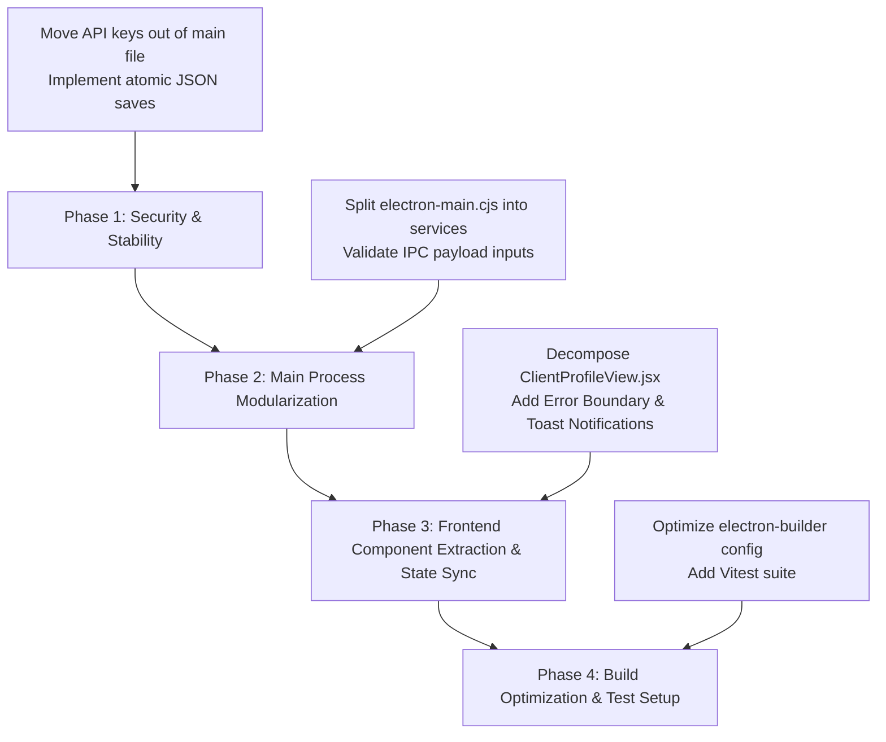

# Beetsma Consultancy CRM — Architecture & Development Journal

> **Last Updated:** August 14, 2026  
> **Status:** Initial Codebase Audit & Improvement Strategy  
> **Target App:** Beetsma Consultancy CRM (Electron + React + Vite)

---

## Executive Summary

The **Beetsma Consultancy CRM** is a feature-rich desktop CRM tailored for financial consultants. It includes client profile management, sales pipelines, product analysis, Google Calendar sync, Project 100 contact tracking, and Gemini AI dossier generation/briefings.

While feature-complete for core workflows, the codebase has accumulated technical debt that impacts performance, maintainability, security, and scalability. This journal documents the current state, identifies key areas for improvement, and establishes a clear roadmap for refactoring.

---

## Key Findings & Improvement Areas

### 1. 🔒 Security & Credential Management (High Priority)
- **Hardcoded Gemini API Key**: `electron-main.cjs` (Line 9) hardcodes an active Google Gemini API key (`GEMINI_API_KEY`).
  - *Risk*: Exposes secret credentials in source control and compiled bundles.
  - *Recommendation*: Move API keys to an environment variable (`.env`) or store securely using Electron's `safeStorage` API with an in-app Settings modal for key configuration.

### 2. 🗄️ Persistence Layer & Data Integrity (High Priority)
- **Synchronous JSON File Persistence (`crm_data.json`)**:
  - `saveDatabase()` in `electron-main.cjs` performs `fs.writeFileSync()` on every single data change.
  - *Issues*:
    - **Main Process Blocking**: Synchronous JSON serialization blocks the Node.js event loop on the main thread, causing UI freezes as dataset grows.
    - **Data Corruption Vulnerability**: Direct `writeFileSync` to the primary DB file risks corrupting data if the app is force-closed or crashes mid-write.
  - *Recommendation*:
    1. Implement **atomic file writes** immediately (`write to temp file` + `fs.renameSync`).
    2. Migrate to an embedded database like **`better-sqlite3`** or **IndexedDB / RxDB** for indexed queries, transactions, and background persistence.

### 3. 🧩 Monolithic Code Organization & Maintainability (Medium-High Priority)
- **Main Process Monolith (`electron-main.cjs` ~2,400 lines / ~100 KB)**:
  - Combines IPC routing, JSON file IO, Google OAuth 2.0 flows, Puppeteer web scrapers, and Gemini API calls into a single file.
  - *Recommendation*: Refactor into modular services:
    - `src/main/services/db.js` — Database access layer
    - `src/main/services/gemini.js` — AI integration & briefing service
    - `src/main/services/googleCalendar.js` — Google OAuth & Calendar sync
    - `src/main/services/socialScraper.js` — Puppeteer & browser automation
    - `src/main/ipc/` — Isolated IPC event handlers

- **React View Monoliths (`src/views/`)**:
  - `ClientProfileView.jsx`: ~125 KB (~3,000+ lines in a single file)
  - `Project100Detail.jsx`: ~90 KB (~2,000+ lines)
  - `ScheduleView.jsx`: ~67 KB
  - `SpecialReportsView.jsx`: ~63 KB
  - *Recommendation*: Extract UI sub-components (Modals, Dossier Cards, Timeline items, Form sections, Data tables) into reusable modules under `src/components/`.

### 4. ⚡ Packaging & Installer Optimization (Medium Priority)
- **`electron-builder` Configuration (`package.json`)**:
  - `package.json` includes `"node_modules/**/*"` in the packaged application files.
  - *Issue*: Bundles developer tools (`vite`, `eslint`, `electron-builder`, etc.) into the production desktop installer, inflating file size by hundreds of MBs.
  - *Recommendation*: Remove `"node_modules/**/*"` from `build.files` since Vite bundles frontend assets and production runtime dependencies into `dist/`.

### 5. 🔄 Global State & Inter-View Data Synchronization (Medium Priority)
- **Isolated Local State**:
  - Views like `DashboardView`, `PipelineView`, and `ClientsView` fetch data on `useEffect` mount independently via IPC calls.
  - *Issue*: Modifying a client or pipeline item in one tab does not update other tabs automatically until manually refreshed or re-mounted.
  - *Recommendation*: Implement a global state store (e.g., `Zustand` or React Context) with IPC event listeners (`ipcRenderer.on('db-updated')`) to keep all open views real-time synchronized.

### 6. 🛡️ Resilience & UX (Medium Priority)
- **Missing React Error Boundaries**:
  - No `<ErrorBoundary>` wrapper in `App.jsx`. Unhandled UI render exceptions will crash the renderer to a blank white screen.
- **Form Validation & Toast Notifications**:
  - User feedback for background IPC operations (e.g., calendar sync, AI enrichment failures) lacks toast notification alerts.

### 7. 🧪 Automated Testing Strategy (Future Enhancement)
- No test runner or test suites currently set up.
- *Recommendation*: Introduce **Vitest** for component/unit tests and **Playwright / Spectron** for E2E Electron testing.

---

## Recommended Refactoring Roadmap

---

## Feature Release: Client Financial Planning & Dynamic Life Event Simulator (August 2026)

### Summary of Completed Architecture & Capabilities
1. **Dedicated Workspace (`ClientFinancialPlanView.jsx`)**:
   - Launched from `ClientProfileView.jsx` with quick KPI preview card and top-level header action.
   - Includes real-time Net Worth & Cash Flow Balance Sheet, Capital Accumulation & Decumulation Runway Graph (Ages 25–90+), Auto-Aggregated Insurance Protection Gap Matrix, Dynamic Life Event Stress-Testing Simulator, and Gemini AI Advisory Action Plan.
2. **Interactive Lifetime Projection Engine**:
   - Compounds liquid and invested assets with annual savings in pre-retirement, transitioning into inflation-adjusted decumulation during retirement with annuity/CPF Life offsets.
   - Renders interactive multi-curve SVG chart with visual retirement gate and capital depletion markers.
3. **Insurance Protection Matrix**:
   - Auto-aggregates in-force policies from `crm_data.json` for Death, TPD, Early CI, Major CI, Hospital Shield, and Disability Income against 10x/4x/2x income benchmarks.
4. **'What-If' Stress-Testing Engine**:
   - Interactive presets for Property Upgrade, Critical Illness Shock, Child University Fund, Pre-Retirement Market Shock (-30%), Total Permanent Disability, and Sabbatical with insurance claim offsets.
5. **IPC Endpoints**:
   - `save-client-financial-plan`: Persists complete plan state to client record.
   - `generate-financial-plan-ai-summary`: Uses Gemini AI with structured schema to generate executive summary, readiness score, key strengths, risk gaps, and consultative talking points.

---

## Feature Release: Client Claims Management & Payout Reconciliation Engine (August 2026)

### Summary of Completed Architecture & Capabilities
1. **Client Claims Hub (`src/components/ClientClaimsSection.jsx`)**:
   - Integrated into `ClientProfileView.jsx` beneath the Policy Portfolio.
   - Real-time aggregate metric counters: Active claims alert, total reimbursed benefits, total incurred bills, and claim reconciliation health pills.
   - Expandable claim cards with provider & policy linkages, stage progression indicators, itemized bill counts, and physical vault file counts.
2. **4-Tab 3-Step Claim Lifecycle Workspace (`src/components/ClaimModal.jsx`)**:
   - **Step 1 (Claim Event Details Tab)**: Defines the overarching claims event (Hospitalisation, CI, Accident, Disability, Death), dates, hospital/clinic, doctor, and links to in-force policies.
   - **Step 2 (Tagged Bills Ledger Tab)**: Dedicated ledger to tag individual clinic and hospital bills/receipts as they arrive (pre-admission MRI, surgery bill, follow-up physio), with attached local receipt files and submission status tracking.
   - **Step 3 (Settlement & Reconciliation Tab)**: Logs Insurer Settlement Statements and EOB letters; live formula automatically audits:
     $$\text{Total Incurred Bills} - (\text{Insurer Paid} + \text{Client Co-Pay / Deductible} + \text{Medisave}) = \text{Unaccounted Variance}$$
     Instantly confirms full settlement ($0 variance) or alerts to unpaid bills/shortfalls.
   - **Step 4 (Document Vault & Notes Tab)**: Centralized repository of medical reports, claim forms, local file viewer (`openPath`), and case progression timeline.
3. **Gemini AI Claim Copilot (`src/components/ClaimAiAssistantModal.jsx`)**:
   - **Mode 1 (Settlement & Bill Reconciliation Audit)**: Cross-examines clinic combined bills against settlement letters and submission summaries to detect unpaid line-items or explain deduction codes.
   - **Mode 2 (Client WhatsApp / SMS Update Generator)**: Drafts compassionate, transparent mobile-ready settlement breakdowns for the client with one-click copy.
   - **Mode 3 (Official Insurer Cover Letter / Appeal Drafter)**: Generates formal letters citing policy numbers, itemized invoices, and clinical justifications.
4. **IPC Endpoints**:
   - `get-claims`, `get-all-claims`, `add-claim`, `update-claim`, `delete-claim`
   - `attach-claim-document`, `open-claim-folder`, `delete-claim-file`
   - `analyse-claim-settlement-reconciliation`, `generate-claim-ai-assist`

---

## Feature Release: CRM Core Enhancements & Claims Quality Suite (August 19, 2026)

### Summary of Completed Improvements (From Consultant Notes)
1. **Claims Section Warnings & Attention Alerts (`src/components/ClientClaimsSection.jsx`)**:
   - Added prominent alert notification banners when active claims require insurer follow-ups (`Information Required`) or have unaccounted reconciliation variances / shortfalls.
   - Enhanced claim card pills to clearly highlight shortfalls and pending bills.
2. **Client Company & Job Title Editing (`src/views/ClientProfileView.jsx`, `src/views/ClientsView.jsx`)**:
   - Added `companyName` and `jobTitle` inputs to both the **Add New Client** modal and the **Edit Client Profile** modal.
   - Updated profile view to immediately re-render edited corporate details.
3. **Clear System Logs (`electron-main.cjs`, `electron-preload.cjs`, `src/components/Sidebar.jsx`)**:
   - Added `clear-log-file` IPC handler and exposed `clearLogFile` in preload.
   - Added a "Clear" button in the Sidebar next to "View Logs" with confirmation and transient feedback.
4. **Enhanced Glassmorphic DatePicker Component (`src/components/DatePicker.jsx`)**:
   - Built a custom, dark-mode native date picker featuring direct **Month** and **Year** dropdown selectors (covering 1920 to 2060 for instant DOB and policy year selection), fast previous/next year chevrons (`<<` and `>>`), fast previous/next month chevrons (`<` and `>`), quick presets (*Today*, *Tomorrow*, *+1 Wk*, *+1 Mo*, *+1 Yr*), and click-outside dismissal.
   - Replaced native date inputs across Task creation, Client DOB, Policy inception dates, Claim incident/admission/discharge/bill/settlement dates, Pipeline, and Campaign milestones.
5. **Integrated Shield Plans MediSave & Cash Outlay Breakdown & 2-Decimal-Place Precision (`src/views/ClientProfileView.jsx`)**:
   - In Policy creation/editing, when plan type is `Shield`, consultant can enter separate MediSave (CPF) and Cash Outlay amounts.
   - All premium and coverage inputs accept decimal values with `step="0.01"` and `min="0"`.
   - Updated `formatCurrency` to dynamically format with 2 decimal places whenever cents are present.
   - Displays MediSave and Cash split in both Policy Card and Horizontal List views.
6. **Horizontal Table / Cards View Switcher (`src/views/ClientProfileView.jsx`)**:
   - Added a View Mode toggle (**Cards** vs. **Horizontal List Table**) for the Policy Portfolio.
   - The table view provides a high-density, horizontal overview of policy status, provider, type, number, premium/split, inception anniversary, coverage pills, and quick edit actions.
7. **Renamed Navigation / Section Label (`src/views/ClientProfileView.jsx`)**:
   - Updated the section header from `Tasks & Follow-ups` to `Tasks/Meetings/Follow-ups`.

---

## Feature Release: OneMap SG Address Autocomplete, Policy Remarks & 'Others' Coverage (August 20, 2026)

### Summary of Completed Improvements
1. **OneMap SG Address Autocomplete (`src/components/AddressAutocomplete.jsx`)**:
   - Integrated Singapore Land Authority's official OneMap Elastic Search API for instant 6-digit postal code (e.g., `048581`), building name, and street name resolution.
   - Built a sleek glassmorphic dropdown with debouncing (250ms), keyboard navigation (Up/Down/Enter/Escape), click-outside dismissal, clear button, and freeform manual typing fallback for unit numbers (`#12-34`) and international addresses.
   - Integrated across:
     - **Client Profile**: Edit Client Profile modal & Task/Meeting creation location (`ClientProfileView.jsx`).
     - **Client Hub**: Add New Client modal (`ClientsView.jsx`).
     - **Schedule & Calendar**: Quick Add Task & Edit Event/Meeting location modals (`ScheduleView.jsx`).
2. **Policy Remarks & Special Notes Box (`src/views/ClientProfileView.jsx`, `electron-main.cjs`)**:
   - Added a multi-line Remarks textarea to the Policy Modal for capturing unique rider terms, nomination status, exclusions, and subset coverage clauses.
   - Rendered Remarks callout box in Policy Cards View and inline remarks preview with hover tooltips in Horizontal Table View.
   - Handled persistence and backward compatibility in `add-policy` and `update-policy` in `electron-main.cjs`.
3. **'Others' Coverage for Unique/Subset Plan Types (`src/views/ClientProfileView.jsx`)**:
   - Added `'Others'` to `COVERAGE_MAP` across all policy types (`Life`, `Term`, `A&H`, `Shield`, `HI`, `ILP`, `Endowment`, `LTC`, `Disability Income`).
   - Enabled advisors to specify custom coverage amounts with 2-decimal precision, rendered dynamically in Policy Cards, Horizontal Table, and Profile Overview.

---

## Feature Release: Financial Blueprint Blank Slate Architecture (August 20, 2026)

### Summary of Completed Improvements
1. **True Blank Slate Initialization (`src/views/ClientFinancialPlanView.jsx`)**:
   - Removed all hardcoded mock/placeholder numbers (`$8,500` earned income, `$65,000` liquid cash, `$140,000` invested assets, mock university/property upgrade goals).
   - A client with no saved financial blueprint now starts with a clean blank state (`''`, `$0`, and empty milestone goals `[]`).
   - Derived metrics, emergency months, savings rate, protection health score, and lifetime accumulation runway gracefully handle empty or zero-value states without `NaN` or division-by-zero errors.
2. **Dynamic Life Event Customization**:
   - Clean life event templates start deactivated (`active: false`) with $0 outlay and $0 monthly impact.
   - Added direct numeric inputs for **Lump Sum Outlay ($)** and **Monthly Impact ($/mo)** on event cards so consultants can configure exact client-specific scenarios.
3. **Empty Slate Visual Guidance & Chart Grace**:
   - Added friendly empty-state banners in the **Wealth Goals Milestone Manager** and **Retirement Runway Chart Canvas** directing advisors to input data.
   - Header displays a distinct `🆕 Blank Slate Blueprint` status badge when a plan is newly initiated.
4. **Client Profile Card Refinement (`src/views/ClientProfileView.jsx`)**:
   - Shows clean `Not Configured` statuses for Target Retirement Age, Monthly Savings, and Net Worth when no blueprint is configured.

---

## Feature Release: Singapore CPF LIFE Advisor Playbook & AI Projection Graph Breakdown (August 20, 2026)

### Summary of Completed Improvements
1. **Singapore CPF LIFE Advisor Playbook (`src/components/CpfLifePlaybookModal.jsx`)**:
   - Integrated directly below the CPF Life / Pension slider in **Tab 2 (Retirement Runway & Wealth Goals)** of `ClientFinancialPlanView.jsx`.
   - **4 Interactive Strategic Knowledge Tabs**:
     - **Tab 1 (Core Mechanics & Age Milestones)**: Longevity annuity protection, Age 55 account restructuring (SA closure from Jan 2025 onwards, SA $\to$ RA $\to$ OA transfer rules, interest up to 6% p.a.), Age 65-70 payout commencement, and the +7%/year (+35% at age 70) deferral incentive bonus.
     - **Tab 2 (The 3 CPF LIFE Plans Compared)**: Standard (level payouts), Escalating (+2% per year inflation hedge), and Basic (maximum bequest) plans with side-by-side comparison matrix.
     - **Tab 3 (2025–2026 Retirement Sums & Payout Tiers)**: BRS ($110,200 $\to$ ~$910/mo), FRS ($220,400 $\to$ ~$1,700/mo), and ERS (4x BRS: $440,800 $\to$ ~$3,300/mo) with one-click **"Apply to Blueprint"** action buttons.
     - **Tab 4 (Bequest & CPF Nomination Rules)**: Capital preservation guarantee explanation and critical advisory guidelines on why CPF cannot be willed and requires online CPF Nomination.
2. **AI Projection Graph Breakdown & Actuarial Audit (`src/components/ProjectionGraphBreakdownModal.jsx`, `electron-main.cjs`)**:
   - Added a **"✨ Graph Breakdown & AI Audit"** button directly to the Lifetime Projection Graph header.
   - **Gemini AI Actuarial Audit**: Evaluates the macro trajectory, accumulation compounding velocity, decumulation inflation drag, annuity cushion, and active stress shocks, providing custom consultative talking points for client meetings.
   - **Mathematical Formulas & Methodology**: Explains recursive accumulation $K(t+1) = [K(t) \times (1 + r)] + \text{Savings} - \text{Outlays}$ and decumulation drawdown mechanics in clear notation.
   - **Interactive Year-by-Year Simulation Ledger**: Filterable table tracking Age, Phase, Annual Cashflow, Ending Capital, and Key Milestones (*Retirement Gate*, *Peak Nest Egg*, *Active Shock*, *Depleted*).
   - **Copy / Export**: One-click formatted summary for client notes.
3. **IPC Endpoints**:
   - Added `generate-projection-graph-breakdown` in `electron-main.cjs` and exposed `generateProjectionGraphBreakdown` in `electron-preload.cjs`.

---

## Feature Release: Multi-Chart Projections Suite & CFP/ChFC/CFA Standard AI Blueprint (August 20, 2026)

### Summary of Completed Improvements
1. **Multi-Chart Projection Suite & Monthly/Annual View (`ClientFinancialPlanView.jsx`)**:
   - Added an interactive chart switcher tab bar directly above the projections canvas with 3 distinct actuarial views:
     - **📈 Capital Runway ($ Nest Egg)**: Multi-curve baseline vs stress-tested liquid/invested capital compounding over the client's working and retirement years.
     - **🌊 Retirement Cashflow Waterfall ($ vs Target)**: Stacked cashflow stream visualization plotting guaranteed CPF LIFE / Annuities, passive income, and portfolio drawdown against the **Inflated Living Expense Target Line**, highlighting any **Deficit / Shortfall** or **Surplus Buffer** in red/green.
     - **🏛️ Net Worth & Asset Evolution**: Stacked asset class trajectory tracking Liquid Cash, Invested Portfolio, CPF/Pension Reserves, and Real Estate Equity over time.
   - **Annual / Monthly Resolution Toggle**: Switch between **Annual ($/yr)** and **Monthly ($/mo)** projections dynamically across all graphs.
2. **CFP® / ChFC® / CFA® Institutional Standard AI Advisory Blueprint (Tab 5)**:
   - Upgraded `generate-financial-plan-ai-summary` in `electron-main.cjs` to produce institutional-grade financial plans adhering to CFP, ChFC, and CFA advisory frameworks.
   - **Advisory Focus Domain Selector**: Allows advisors to select from 5 specialized priority domains:
     - 🌐 *Holistic 360° CFP Plan*
     - 🏖️ *Early Retirement & FIRE Strategy*
     - 🛡️ *Comprehensive Risk & CI Protection*
     - 📈 *Wealth Accumulation & Yield Optimization*
     - 🏛️ *Estate Planning, CPF & Legacy Transfer*
   - **Advisor Custom Scenario & Question Input**: Dedicated textarea with interactive quick prompt chips (e.g., *"Can client retire at 58 with $5,500/mo spending?"*), enabling Gemini AI to evaluate custom trade-offs and quantitative requirements.
   - **Institutional Blueprint Presentation UI**:
     - 3 Health & Readiness Score Gauges (*Overall Financial Health*, *Retirement Readiness*, *Protection Matrix Score*).
     - **Dedicated Focus & Client Scenario Evaluation Card** with specific query answer, key trade-offs, and actionable fixes.
     - **Singapore CPF LIFE & Guaranteed Annuity Strategy Callout**.
     - Core Strengths & Critical Vulnerabilities.
     - Prioritized Strategic Recommendations with Category tags, Priority badges, Quantitative Rationale, and Step-by-Step Implementation Steps.
     - Stress-Testing & Resilience Assessment.
     - Advisor Meeting Opener Script.

---

## Feature Release: CPF/SRS Account Breakdown & Institutional PDF Report Export (August 20, 2026)

### Summary of Completed Improvements
1. **Fixed Tab Bar Navigation Visibility & Sticking**:
   - Updated `.nav-tabs-bar` with `position: sticky`, `top: 0px`, `z-index: 100`, and `background: rgba(15, 23, 42, 0.98)`, ensuring the 5 section tabs remain accessible and never covered when scrolling through any page.
2. **Singapore CPF Account Breakdown & Separate SRS**:
   - Added granular breakdown for:
     - **CPF Ordinary Account (OA - 2.5% p.a.)**
     - **CPF Special Account (SA - 4.0% - 5.0% p.a.)**
     - **CPF Retirement Account (RA - 4.0% - 6.0% p.a.)**
     - **CPF MediSave Account (MA - 4.0% p.a.)**
     - **Supplementary Retirement Scheme (SRS - Tax-Deferred voluntary account)**
   - Included visual badges and automatic calculation of Total Combined CPF and SRS balances.
   - Updated AI summary prompt and net worth metrics to ingest the new breakdown.
3. **Institutional PDF Report Export & Print Styling**:
   - Added `export-financial-plan-pdf` IPC handler in `electron-main.cjs` using Electron's `webContents.printToPDF` and `dialog.showSaveDialog`.
   - Exposed `exportFinancialPlanPdf` in `electron-preload.cjs`.
   - Added **"📄 Export PDF Report"** and **"🖨️ Print"** buttons in Tab 5.
   - Added comprehensive `@media print` rules in `src/index.css` for clean, multi-page, branded A4 PDF exports.
4. **Desktop Dist Rebuild**:
   - Successfully executed `npm run electron:build` and synchronized Windows binaries in `dist/`.

---

## Feature Release: Comprehensive Multi-Page CFP® & Singapore CPF Financial Blueprint Dossier (August 20, 2026)

### Summary of Completed Improvements
1. **CFP® & Singapore CPF Standard Financial Plan Architecture**:
   - Researched Singapore CFP/ChFC/MAS comprehensive financial plan standards, integrating national CPF schemes (OA, SA, RA, MA, CPF LIFE, MediShield Life), asset-liability schedules, cashflow dynamics, in-force policy listings, protection benchmarks, and strategic roadmap matrices.
2. **Multi-Page Comprehensive Financial Blueprint Dossier (Tab 5)**:
   - **Executive Cover & Particulars**: Beetsma Advisory Group branding, Client particulars (Name, Age, Target Retirement Age, Life Expectancy, Retirement Horizon), and Multi-Discipline Framework standards (CFP® / ChFC® / CFA®).
   - **Section 1: Executive Assessment & 3 Health Scores**: Overall Financial Health Score (/100), Retirement Readiness Score (/100), and Protection Matrix Score (/100) with client scenario evaluation.
   - **Section 2: Statement of Net Worth & Balance Sheet Schedule**: Full breakdown table of Liquid Cash (with emergency runway months), Investments, CPF OA (2.5%), SA (4.0-5.0%), RA (4.0-6.0%), MA (4.0%), SRS, Real Estate Equity, and Liabilities.
   - **Section 3: Monthly Cash Flow & Savings Capacity**: Earned vs passive inflows, living vs debt outflows, monthly surplus velocity, and savings rate %.
   - **Section 4: Retirement Runway & Singapore CPF LIFE Strategy**: Desired retirement income vs inflated future need, projected peak nest egg, CPF LIFE payout tier (BRS/FRS/ERS), plan comparison (Standard vs Escalating vs Basic), and age 55/65-70 milestones.
   - **Section 5: In-Force Insurance Policy Schedule (Full Table Listing)**: Detailed table listing all client policies (Policy #, Insurer, Plan Name, Type, Premium, Status, and Coverages breakdown).
   - **Section 6: Protection Benchmark vs In-Force Gap Matrix**: Life/Death (10x + debt), TPD (10x), Early CI (2x), Major CI (5x), Disability Income (75% monthly), Hospital Shield Plan with shortfall/surplus tags.
   - **Section 7: Prioritized Strategic Action Roadmap**: High/Medium/Low priority recommendations with quantitative rationale and step-by-step implementation steps.
   - **Section 8: Advisor Client Meeting Opener Script & Annual Review Cadence**.
   - **Section 9: Professional Standards & Compliance Disclaimers** (CFP Board / MAS Standard).
3. **Multi-Page A4 PDF Export & Print Pagination**:
   - Optimized `@media print` rules in `src/index.css` with page breaks (`.print-page-break`, `.print-avoid-break`) and table formatting for multi-page A4 PDF export.
4. **Desktop Dist Rebuild**:
   - Rebuilt Windows distribution package with `npm run electron:build`, synchronizing `dist/Beetsma Consultancy CRM Setup 0.0.1.exe`.

---

## Feature Release: Dedicated Institutional Client-Facing PDF Report Engine (August 20, 2026)

### Summary of Completed Improvements
1. **Dedicated Client-Facing PDF Document Architecture (Not App Screenshots)**:
   - Implemented `generateFinancialPlanReportHtml(payload)` in `electron-main.cjs` to render an institutional, white-paper A4 advisory report in a headless background window.
   - Completely decoupled from the CRM's dark-mode UI, navigation bars, buttons, and input controls.
   - Features corporate navy/gold accents, official Beetsma Advisory Group branding, running headers and footers on every page, page numbering, and structured tables.
2. **6-Page Publication-Grade Client Dossier**:
   - **Page 1: Formal Cover Page & Table of Contents**: Corporate branding crest, document title, client particulars, CFP®/ChFC®/CFA® advisory standard, and table of contents.
   - **Page 2: Executive Assessment & 3-Pillar Scorecard**: 3 diagnostic scorecards (Overall Health, Retirement Readiness, Protection Matrix), statement of financial position narrative, strategic scenario evaluation, and core strengths vs. vulnerabilities.
   - **Page 3: Net Worth, Balance Sheet & Cash Flow Velocity**: Complete balance sheet table (Liquid Cash, Invested Portfolios, CPF OA/SA/RA/MA, SRS, Property, Debt) and cashflow metrics.
   - **Page 4: Retirement Runway & Singapore CPF LIFE Strategy**: Decumulation roadmap, peak nest egg, CPF LIFE plan analysis (Standard vs. Escalating vs. Basic), and longevity solvency assessment.
   - **Page 5: In-Force Policies & Protection Gap Matrix**: Full audited schedule table of all client policies and protection gap matrix with benchmark comparisons.
   - **Page 6: Prioritized Strategic Action Roadmap & Fiduciary Disclaimers**: Prioritized recommendations roadmap, capital stress-testing, advisor consultation opener, and MAS/CFP Board compliance disclaimers.
3. **Interactive In-App Preview & Export**:
   - Added **"👁️ Preview Client Document"** button and modal in Tab 5 to inspect the document before exporting.
   - Updated **"📄 Export Client PDF Document"** to pass all client and plan data to the dedicated PDF generator.
4. **Desktop Dist Rebuild**:
   - Executed `npm run electron:build` and synchronized Windows binaries in `dist/`.

---

## Feature Release: Practice & Consultant Settings with Dynamic Report Branding (August 20, 2026)

### Summary of Completed Improvements
1. **Dedicated Practice & Advisor Settings View (`SettingsView.jsx`)**:
   - Added **Settings** tab in the main sidebar and registered in `App.jsx`.
   - **Consultant Profile**: Consultant Full Name, Professional Title, Agency / Practice Name, MAS Representative / License Number, Direct Phone, Business Email, Office Address.
   - **Professional Designations & Accreditations**: Interactive credential badges for `CFP®`, `ChFC®`, `CFA®`, `AEPP®`, `CLU®`, `IBF Advanced`, `MDRT`, `COT`, `TOT`, and custom credential additions.
   - **Report Branding & Disclaimers**: Custom header banner branding, practice slogan, default currency, and regulatory compliance disclaimers.
   - **Actuarial Assumptions**: Default pre-retirement return %, post-retirement return %, inflation rate %, retirement age, life expectancy, and emergency months buffer.
   - **System Diagnostics & Logs**: Integrated log viewer and clear log tools.
2. **Dynamic Consultant Branding on Client PDF Reports**:
   - Decoupled hardcoded company names; now dynamically uses `Prepared by [Consultant Name]` and `[Agency / Practice Name]`.
   - Running headers and footers across all 6 pages dynamically display the active consultant's credentials and practice details.
3. **IPC & Persistence**:
   - Added `get-app-settings` and `save-app-settings` IPC handlers in `electron-main.cjs` with JSON persistence in `crm_data.json`.
   - Exposed `getAppSettings` and `saveAppSettings` in `electron-preload.cjs`.
   - Updated `ClientFinancialPlanView.jsx` to load and pass `consultantSettings` into PDF generation and in-app preview.
4. **Desktop Dist Rebuild & Main Process Fix**:
   - Resolved main process syntax error in `electron-main.cjs` for `generateFinancialPlanReportHtml`.
   - Verified with `node -c electron-main.cjs`, `node -c electron-preload.cjs`, and `npm run build`.
   - Executed `npm run electron:build` and synchronized Windows binaries in `dist/`.

---

## Feature Release: Client PDF Clean Consultant Branding & Embedded Retirement Charts (August 20, 2026)

### Summary of Completed Improvements
1. **Removed All Agency / Organisation References**:
   - Completely stripped agency/organisation mentions from the PDF generator, cover page, running headers, and running footers.
   - Standardized on consultant-focused attribution: `Prepared by: [Consultant Name], [Consultant Title]`, `MAS Rep No: [Rep Number]`, and direct contact info.
2. **Configurable Document Header & Optional Subtitle**:
   - Replaced hardcoded "Chartered Wealth & Retirement Practice" with user-configurable `reportHeaderBranding` (default: `FINANCIAL ADVISORY BLUEPRINT`) and optional `reportSubtitle`.
   - If no subtitle is provided in Settings, no generic subtitle is shown.
3. **Embedded High-Resolution Vector Retirement SVG Charts & Formulations on Page 4**:
   - **Capital Accumulation & Decumulation Runway (Vector SVG)**: Displays capital trajectory from current age to life expectancy with peak capital at retirement and depletion markers. Accompanied by formulation breakdown of accumulation compound growth and decumulation drawdowns.
   - **Retirement Income Streams & Cash Flow Waterfall (Vector SVG)**: Displays stacked annual cash flows in retirement (Guaranteed CPF LIFE / Annuity foundation layer, Portfolio drawdown layer, and Target Inflated Living Need line). Accompanied by analysis of guaranteed income floor stability.
4. **Desktop Dist Rebuild**:
   - Executed `npm run electron:build` and synchronized Windows binaries in `dist/`.

---

## Feature Release: Client PDF Clean & Professional Terminology Overhaul (August 20, 2026)

### Summary of Completed Improvements
1. **Professional Terminology Revision**:
   - Replaced all flashy, buzzword-heavy, and bombastic headings, badges, and phrases across the PDF generator, in-app preview modal, settings defaults, and AI prompts with understated, professional, and clear financial planning language.
   - **Cover Page**: `CONFIDENTIAL FINANCIAL REPORT`, `Comprehensive Financial Plan`, `COMPREHENSIVE FINANCIAL PLAN & RETIREMENT PROJECTION`, `Client Profile & Plan Details`, `Focus Area:`, `Professional Designations:`.
   - **Page 2**: `1. Executive Summary & Key Financial Indicators`, `Overall Financial Health`, `Retirement Readiness`, `Insurance Coverage`, `Executive Summary & Financial Position`, `Scenario Analysis & Focus Area`, `Financial Strengths` vs `Key Considerations & Areas for Improvement`.
   - **Page 3**: `2. Net Worth Statement & Balance Sheet`, `TOTAL NET WORTH`, `3. Cash Flow & Savings Analysis`, `Cash Flow Summary`.
   - **Page 4**: `4. Retirement Planning & CPF Projections`, `Target Retirement Income`, `Projected Nest Egg`, `Estimated CPF LIFE / Annuity Floor`, `Capital Accumulation & Drawdown Projection`, `Projected Retirement Income vs. Living Expenses`, `Accumulation Phase` vs `Drawdown Phase`, `CPF LIFE & Retirement Strategy`.
   - **Page 5**: `5. Insurance Policies & Coverage Analysis`, `Existing Insurance Policies`, `Insurance Coverage vs. Recommended Guidelines`, `Recommended Benchmark`, `Current Cover`, `Recommended Cover`, `Coverage Status`.
   - **Page 6**: `6. Action Plan & Next Steps`, `Action Steps:`, `Stress-Test & Scenario Insights`, `Discussion Points for Consultation`, `Important Regulatory & Advisory Notice`.
2. **AI System Instructions Refinement**:
   - Refined `generate-financial-plan-ai-summary` and `generate-projection-graph-breakdown` system instructions to produce objective, clear, and professional advisor summaries free of marketing hype.
3. **Desktop Dist Rebuild**:
---

## Feature Release: Client Online Profile Deep Search Engine, Pre-Meeting 90-Day Brief & Multi-Platform Intelligence Suite (August 20, 2026)

### Summary of Completed Improvements
1. **Multi-Platform Search Grounding & Candidate Disambiguation**:
   - Upgraded `discover-client-socials` IPC handler to query Google Search Grounding with targeted multi-queries covering LinkedIn, Instagram, TikTok, Facebook, X/Twitter, YouTube, Threads, and Singapore business/news outlets.
   - Built candidate account deduplication with match confidence scoring (`High`, `Medium`, `Low`) and match rationales.
   - Created `SocialDiscoveryModal.jsx` allowing advisors to verify candidate profiles with 1-click URL launch before running deep enrichment.

2. **360° AI Client Dossier & 6 Pillars of Advisory Intelligence**:
   - Upgraded `enrich-client-profile` to synthesize public career updates, business news, and lifestyle activities into:
     - **Executive & Career Overview**: Seniority level classification, role progression, and corporate growth footprint.
     - **Behavioral & Lifestyle Radar**: Hobbies, passions (e.g. Golf, Marathon, Luxury, Travel, Fitness, Philanthropy), and thematic tags.
     - **Life Stage Triggers & Wealth Events**: Promotions, newborn, home purchase, marriage, business expansion, and liquidity events mapped to actuarial and financial planning recommendations.
     - **Business & Key Person Risk Flags**: Keyman risks, director liabilities, SME succession vulnerabilities, and recommended safeguards.
     - **Multi-Tone Icebreakers & Outreach Copilot**: Ready-to-use conversation starters tailored for WhatsApp, LinkedIn, and SMS.
     - **Grounding Notes**: Citing discovered public web articles and profile references.

3. **90-Day Pre-Meeting Intelligence Brief Cheat Sheet**:
   - Added `generateClientMeetingBrief` (`generate-client-meeting-brief` IPC handler) synthesizing past 90 days of online signals against client's in-force CRM policies and financial blueprint runway.
   - Outputs:
     - 3 Prioritized Conversation Starters & Personal Updates.
     - Policy & Gap Alignment (linking recent life triggers to specific coverage or runway gaps).
     - Recommended 3-Step Meeting Agenda & Strategy.
     - High-Priority Financial Solutions & Key Person Safeguards.
   - Created `PreMeetingBriefModal.jsx` with 1-click meeting prep copying and structured export.

4. **Multi-Platform Scraper & Offscreen Browser Automation**:
   - Upgraded `open-social-login-window` supporting LinkedIn, Instagram, TikTok, Facebook, X/Twitter, and YouTube in persistent partition `persist:social_accounts` so advisor session cookies persist across app restarts.
   - Upgraded `run-browser-social-scan` to parse handles and extract authentic post captions, dates, engagement, and media offscreen.
   - Built `AddSocialPostModal.jsx` for importing posts and news items with instant Gemini actuarial analysis and conversation starters.
   - Created `ClientSocialIntelligenceSection.jsx` providing a unified, modular UI with platform filter tabs, image preview rendering, and expandable full post content.

5. **Desktop Dist Rebuild**:
   - Executed `npm run electron:build` and synchronized Windows binaries in `dist/`.

### Feature Update (August 20, 2026): Full Uncropped Social Post Display & Feed Deduplication

- **Uncropped Image Rendering (`SocialPostImage`)**:
  - Replaced restrictive `object-fit: cover` and fixed heights with `object-fit: contain`, `width: 100%`, and `maxHeight: 550px`.
  - Added full-resolution photo preview with direct external full-resolution image launch.
- **Complete Post Text Display**:
  - Displayed full un-truncated post text (`fullCaption || content`) directly on the post card with preserved formatting (`white-space: pre-wrap; word-break: break-word; line-height: 1.6`).
  - Eliminated duplicate snippet vs full-text display and removed redundant accordion toggle.
- **Deduplication Engine**:
  - Deduplicated media items attached to each post so duplicate URLs or thumbnails are never rendered.
  - Implemented client-side and backend deduplication in `ClientSocialIntelligenceSection.jsx`, `enrich-client-profile`, and `run-browser-social-scan` to ensure identical posts are never duplicated across the feed.

---

## Feature Release: Client Profile Hybrid Tabbed Workspace & Smart Collapsible Sections (August 23, 2026)

### Problem & UX Overhaul Rationale
Prior to this release, opening a client in `ClientProfileView.jsx` loaded 9 dense, heavy modules simultaneously down a single screen (Profile, Financial Blueprint preview, Family Grouping, Document links, Tasks schedule form, Remarks + AI guidance, 360° AI Dossier, Social Posts Feed, Policy list, and Claims Portfolio). This caused significant cognitive overload, slow scanning, and vertical scroll fatigue for consultants during meetings.

### Architectural Solution Implemented (Option 3 Hybrid Model)
1. **Reusable Collapsible Section Container (`CollapsibleSection.jsx`)**:
   - Built a sleek glassmorphism-styled collapsible card component with persistent open/collapse state via `localStorage`.
   - Features dynamic header pill badges that summarize section state even when collapsed (e.g. `4 Policies • $12,400/yr`, `2 Tasks Pending`, `Dossier Ready`, `3 Members Linked`).
   - Integrated action slots directly in the header (e.g. `+ Add Policy`, `+ Add Task`, `Edit Profile`, `+ Link Member`).

2. **Dedicated Workspace Tabs (`ClientProfileView.jsx`)**:
   - **📋 Overview & Activity**: Demographics, Social links, Financial Blueprint summary card, Consultant Remarks & Gemini AI Advisor Guidance, Tasks & Meetings schedule with quick-add form.
   - **🛡️ Policies & Claims**: Summary KPI banner (Total Policies, Annual Portfolio Premium, Active Claims, Upcoming Renewal Alerts), Policy Portfolio (Cards/Table view toggle), and Claims Portfolio & Payout Reconciliation.
   - **🧠 AI Dossier & Social Intel**: 360° AI Client Dossier, 90-Day Pre-Meeting Brief, Auto-Discovery, Opportunity Radar, and Multi-Platform Social Media Feed.
   - **👨‍👩‍👧 Family & Documents**: Household combined portfolio metrics, linked family members, and document/cloud storage links.

3. **View Mode Switcher (`Tabs` vs `All-in-One`)**:
   - Allows advisors to switch at will between a zero-scroll, high-focus **Tabbed View** and a single-page **All-in-One Collapsible Accordion View** with instant state retention.

4. **Claims & Portfolio Harmonization (`ClientClaimsSection.jsx`)**:
   - Wrapped claims management into `CollapsibleSection` with urgent attention alert banners, status pills, and direct access to Claim AI Copilot & Reconciliation modal.

---

## Major Product Release: Sales Performance Command Center, Global Command Palette & Productivity Suite (August 23, 2026)

### Key Features Delivered
1. **Sales Performance & MDRT Command Center (`SalesTrackingView.jsx`)**:
   - Upgraded placeholder into a full analytics command center.
   - **MDRT / COT / TOT Pacing Thermometer**: Calculates year-to-date achieved FYC against Singapore industry benchmarks (MDRT: S$110k, COT: S$330k, TOT: S$660k), monthly required run-rate over remaining months, and real-time pace status (*Ahead of Pace* / *On Track* / *Pacing Required*).
   - **Monthly Production Velocity (SVG Bar Chart)**: Tracks Jan-Dec monthly FYC production vs benchmark targets.
   - **Product Mix & Revenue Distribution**: Breakdown across Life, Term, Integrated Shield, ILP, Endowment, and Disability Income.
   - **Sales Conversion Funnel**: Drop-off percentages across *Prospects → Fact Finding → Proposals → Case Issued* and overall win-rate metrics.

2. **Global Command Palette & Quick Search (`CommandPalette.jsx` / `Ctrl+K`)**:
   - Global keyboard listener (`Ctrl+K` on Windows/Linux, `Cmd+K` on Mac) accessible from any view.
   - Fuzzy search over Clients, Policies, Pipeline Deals, and Navigation shortcuts with keyboard arrow navigation.
   - Direct 1-click jump to selected client or deal.

3. **Live Dynamic Sidebar Target Sync (`Sidebar.jsx`)**:
   - Replaced static target indicator with live computation of current Month-to-Date issued FYC from the database vs monthly run-rate.

4. **In-App Toast Notification Engine (`Toast.jsx`)**:
   - Lightweight, non-blocking glassmorphism notifications for saves, status updates, task completions, and calendar synchronization.

5. **Pipeline Kanban Drag-and-Drop & Forecasting (`PipelineView.jsx`)**:
   - Native HTML5 drag-and-drop between pipeline stages (*Prospect → Fact Finding → Proposal Sent → Case Submitted → Case Issued*).
   - Stage revenue headers displaying active case count, total FYC, and total premium.
   - **Weighted Expected FYC** toggle calculating probability-discounted pipeline forecasting.

6. **Dashboard Milestones & Interactive Drill-Downs (`DashboardView.jsx`)**:
   - **Upcoming Client Milestones (Next 14 Days)**: Proactively surfaces birthdays (with turning age & direct WhatsApp trigger) and 30-day policy renewal anniversaries.
   - Interactive top KPI cards for 1-click navigation into filtered Clients, Pipeline, and Sales views.
   - Top-right `+ Add Client` and `+ New Deal` quick action triggers.

7. **Client Tagging & Smart Segmentation (`ClientsView.jsx`)**:
   - Multi-tag segmentation (`VIP`, `HNW`, `Doctor`, `Tech`, `Business Owner`, `Young Family`, `Retiree`, `Referral Partner`).
   - Tag filter chips above the client index table for segmented campaigns.

8. **Remuneration Live Pipeline Sync & Reverse Goal Planner (`RemunerationView.jsx`)**:
   - **Sync from Pipeline**: 1-click aggregation of Q1-Q4 FYC and case counts from the CRM database.
   - **Target Goal Reverse Planner**: Input desired net annual income (e.g. S$150,000) to calculate required annual/monthly FYC and case volume.

9. **Project 100 CSV & VCF Bulk Import (`Project100Detail.jsx`)**:
   - Added batch contact import parsing spreadsheet `.csv` and phone `.vcf` vCard files.

---

## Feature Release: Special Projects & Strategic Campaigns AI Intelligence Suite (August 26, 2026)

### Summary of Completed Improvements
1. **Special Projects Master Command Center (`SpecialProjectsView.jsx`)**:
   - **Multimodal AI Brochure Scanner**: Added interactive drag-and-drop uploader for insurer PDF brochures (`.pdf`) and product images (`.png`/`.jpg`). Automatically parses brochures via Gemini AI multimodal vision into product USP, target personas, 3-step WhatsApp scripts, and objection counter-scripts.
   - **Expanded Singapore Campaign Playbook Library**: Added 8 comprehensive templates covering *AIA Protect 3 / Major CI Gap*, *SRS Year-End Tax Relief*, *CPF SA Closure & Age 55 Restructuring*, *Child Education Endowment*, *MediShield Life 2025/2026 Limit Revision*, *HNW Legacy & IUL*, *Early CI Kickstarter*, and *CareShield Life Disability Booster*.
   - **Cross-Initiative ROI Header Bar**: Tracks live aggregate Campaign ANP, Campaign FYC, Secured Appointments, and Active Initiatives.

2. **Outreach Campaign Workspace & Smart Audience Segmentation (`OutreachCampaignDetail.jsx`)**:
   - **Smart Batch Audience Segmentation & Multi-Select Enrollment**: Allows 1-click batch filtering and multi-enrollment for:
     - *Clients with No CI Protection* (audited from in-force policies)
     - *Shield-Only Clients (No Life/Wealth)*
     - *High Earners ($80k+/yr / SRS Target)*
     - *Young Families & Parents*
     - *Project 100 High Priority Prospects ($\ge 4.0\bigstar$)*
   - **3-Tab Modular Workspace**:
     - *Tab 1 (🎯 Targets & 1-Click Outreach)*: Filterable target table, stage selector, 1-click Copy Step 1/2/3, and direct `wa.me` WhatsApp launch.
     - *Tab 2 (📖 Playbook & Objections Hub)*: 3-Step WhatsApp sequence preview, daily outreach cadence checklist, and advisor objection handling cheat sheet.
     - *Tab 3 (📊 Funnel Analytics & Scorecard)*: Stage drop-off velocity, ANP/FYC metrics, 1-click copy scorecard, and CSV export.
   - **Two-Way Appointment $\to$ Calendar Sync**: Automatically prompts quick appointment creation with OneMap SG address autocomplete and Google Calendar sync upon reaching `4. Appt Booked`.
   - **Centralized Pipeline & MDRT Sync**: Automatically registers closed cases into `db.pipeline` with `stage: 'Case Issued'`, updating `SalesTrackingView` and MDRT pacing.

3. **Project 100 AI Icebreaker & Prospecting Copilot (`Project100Detail.jsx`)**:
   - **✨ AI Icebreaker Copilot Modal**: Analyzes prospect's N.A.S.T ratings, relationship category, and notes to generate 3 customized WhatsApp approaches (*Option A: Casual Re-Connection*, *Option B: Life Stage Review*, *Option C: Direct Value Hook*) with 1-click copy, WhatsApp launch, and consultative meeting talking points.
   - **1-Click Enroll into Campaign**: Directly push any Project 100 prospect into an active product campaign.
   - **Two-Way Calendar Sync**: Automatically schedules calendar meetings when stage is set to `Meeting Scheduled`.
   - **Export CSV**: Full Project 100 contact and rating schedule export.

4. **IPC & Preload Endpoints (`electron-main.cjs`, `electron-preload.cjs`)**:
   - `generate-outreach-playbook`: Upgraded Gemini prompt with multimodal PDF support and objection handling.
   - `generate-project-100-icebreaker`: New IPC handler for customized N.A.S.T. conversational openers.
   - **AI Model Upgrade to `gemini-3.7-flash`**: Upgraded API backend model to Google's flagship `gemini-3.7-flash` (with fallback compatibility to `gemini-3.5-flash-lite`), providing superior actuarial reasoning, LIA benchmark accuracy, and multimodal brochure vision processing.

5. **In-Workspace Brochure Re-scanner & Live Auto-Scan Upgrade**:
   - **Auto-Scan on Upload (`SpecialProjectsView.jsx`)**: Dragging or selecting a brochure PDF/image immediately triggers Gemini 3.7 Flash analysis, pre-filling campaign fields and generating the custom playbook before launch.
   - **In-Workspace Brochure Re-scan (`OutreachCampaignDetail.jsx`)**: Added a **"✨ Re-scan Brochure / Regenerate Playbook"** action in Tab 2 (*Playbook & Objections Hub*) enabling advisors to upload new brochures or custom notes into existing campaigns at any time to instantly update scripts, objections, and USPs without losing enrolled prospects or progress.

6. **Prospect-to-Client & Pipeline Conversion Suite (`Project100Detail.jsx`, `OutreachCampaignDetail.jsx`, `App.jsx`)**:
   - **1-Click Port to Core Clients Database**: Added direct porting capabilities from Project 100 and Campaign target lists into `db.clients` (`clientStatus: 'Prospect'` or `'Active'`), pre-populating contact details, tags (`['Project 100', 'Campaign: ...']`), and N.A.S.T notes.
   - **Smart Duplicate Prevention & Linking**: Checks existing `clients` by phone, email, or full name. If matched, links `portedClientId` / `clientId` directly without creating duplicates.
   - **Direct Client 360 Navigation Badge**: Ported contacts display a clickable `✓ Client ↗` badge that navigates directly into the client's comprehensive 360 profile.
   - **Milestone-Triggered Pipeline Opportunities**:
     - Moving to `Meeting Scheduled` / `Fact Finding` in Project 100 or `4. Appt Booked` in Campaigns provides 1-click creation of active sales deals in `db.pipeline`.
     - Moving to `5. Case Closed` / `Ported / Converted` auto-registers `Case Issued` deals with finalized ANP/FYC and updates live MDRT tracking.

7. **GitHub Releases Auto-Update Engine (`electron-updater`, `UpdateNotificationBanner.jsx`, `SettingsView.jsx`)**:
   - **Automated Update Detection & Lifecycle**: Integrated `electron-updater` with GitHub Releases provider (`DeathArchPieter/CRM`). Checks for new releases on startup and in the background.
   - **In-App Update Prompt & Live Download Tracking**: Added floating glassmorphic `<UpdateNotificationBanner />` in `App.jsx` displaying new version numbers, release notes, real-time download percentage bar, and 1-click **"Restart & Install Now"** action.
   - **Settings Tab Version Control**: Added **"Application Updates & Version Control"** card in `SettingsView.jsx` showing current installed version and manual **"Check for Updates"** button.

8. **Interactive Guide Assistant ("Archie") & Universal `(i)` Info Tooltip System (`AssistantGuide.jsx`, `InfoTooltip.jsx`)**:
   - **Floating Context-Aware Guide Assistant ("Archie")**: Added an animated, interactive advisor guide floating widget in `App.jsx`. Automatically provides tailored greetings, 3-step action checklists, and financial pro tips for all 10 core views.
   - **Universal Glassmorphic `(i)` Info Tooltips**: Created reusable `<InfoTooltip />` component with bold headers, plain-English explanations, and statutory MAS/LIA actuarial benchmarks. Deployed across Settings, Project 100, and Outreach Campaigns.
   - **Gemini AI API Key Protection**: Secured Google Gemini API keys via `.env` and in-app database settings with complete exclusion from GitHub tracking.

---

## Feature Release: Seamless Inline Auto-Updates & Archie 2.0 Contextual Advisory Copilot (August 2026)

### Summary of Completed Improvements

1. **Seamless Inline & Silent Auto-Updates (`package.json`, `electron-main.cjs`, `UpdateNotificationBanner.jsx`, `SettingsView.jsx`)**:
   - **Zero Setup Wizard Screens**: Replaced standard NSIS multi-step installer wizard with silent 1-click updates (`nsis.oneClick: true`, `nsis.perMachine: false`, `nsis.allowElevation: true`).
   - **Automatic Background Downloading**: Configured `autoUpdater.autoDownload = true` in `electron-main.cjs` to download releases silently without blocking the advisor.
   - **Instant 2-Second Restart Swap**: Upgraded `quitAndInstall` invocation to `autoUpdater.quitAndInstall(true, true)` (`isSilent: true, isForceRunAfter: true`), enabling seamless binary replacement and auto-relaunch with zero prompts or "Next / Finish" buttons.
   - **Updated Notification Banner & Settings**: Real-time progress pills and 1-click **"Restart & Apply Now"** button.

2. **Archie 2.0 Deeply Context-Aware Advisory Copilot (`AdvisorContext.jsx`, `advisorKnowledgeBase.js`, `AssistantGuide.jsx`)**:
   - **Global Context Registry & Hook (`AdvisorContext.jsx`)**: Created lightweight state manager and `useAdvisorContext()` hook tracking active section, sub-sections (`client-profile`, `financial-plan`, `project-100`, `outreach-campaign`), active sub-tabs, entity context (client name, policy counts, campaign title), and action dispatchers.
   - **Resolved Key Mismatches**: Fixed tab naming mismatches (`special-projects`, `special-reports`, `product-analysis`) ensuring 100% of CRM views load custom guidance.
   - **25+ Contextual Playbooks (`advisorKnowledgeBase.js`)**: Tailored action checklists, briefings, and pro tips across Client Profile tabs (Overview, Policies & Claims, AI Dossier & Social Intel, Household), Financial Blueprint tabs (Balance Sheet & CPF breakdown, Retirement Runway & CPF LIFE, Protection Gap Matrix, Life Event Simulator, 6-Page PDF Dossier), Special Projects (Campaign Hub, Project 100 N.A.S.T ranking, Outreach Targets, Playbook & Objections, Analytics), Schedule, Pipeline, Sales, Remuneration, and Settings.
   - **3-Tab Drawer Architecture (`AssistantGuide.jsx`)**:
     - **Tab 1 (🧭 Guidance & Actions)**: Live contextual briefing, sub-tab action checklist with state memory, and **1-Click Quick Action Triggers** (e.g. `🏛️ Open Financial Blueprint`, `📋 90-Day Pre-Meeting Brief`, `📖 CPF LIFE Playbook`, `✨ AI Graph Breakdown`, `+ Add Contact`, `+ Add Policy`).
     - **Tab 2 (📖 Singapore Actuarial Cheat Sheet)**: Interactive reference tables for 2025/2026 CPF LIFE Retirement Sums (BRS $110.2k, FRS $220.4k, ERS 4x BRS $440.8k), CPF interest rates, MAS 10x/5x/2x protection formulas, and MDRT 2026 qualification tiers.
     - **Tab 3 (💬 Ask Archie & Script Copilot)**: Real-time search engine with instant answers and 1-click **"Copy Script"** for 50+ Singapore financial advisory questions, objection handlers, and client WhatsApp openers.
   - **Dynamic Floating Pill & Keyboard Shortcut**: Floating button dynamically displays the active section (e.g., `🦉 Archie • Policies & Vault` or `🦉 Archie • CPF LIFE Projections`), toggleable globally via `Ctrl + /`.

3. **Gemini AI Engine Compatibility & API Key Auto-Persistence (`electron-main.cjs`, `SettingsView.jsx`, `DashboardView.jsx`)**:
   - **Model & Payload Compatibility**: Fixed `thinkingConfig: { thinkingLevel: 'MINIMAL' }` which caused Google's API to reject requests with `HTTP 400: Thinking level is not supported for this model`. Set default model to `gemini-2.5-flash` with clean generation config.
   - **Auto-Persistence on Test & Save**: Clicking **"⚡ Test & Save"** or editing the key in Settings automatically persists the new API key to local database storage (`db.appSettings.geminiApiKey`), sets `process.env.GEMINI_API_KEY`, and synchronizes `.env`.
   - **Dedicated "Save Key" Button & Blur Auto-Save**: Added direct **"💾 Save Key"** button and `onBlur` auto-save in [SettingsView.jsx](file:///c:/dev/CRM/src/views/SettingsView.jsx) with visual confirmation badge (`✓ Saved!`).
   - **Instant AI Briefing Cache Invalidation**: Saving/testing a new key immediately clears any cached 403 error in `db.aiBriefing`, enabling the dashboard to generate a fresh briefing immediately.
   - **Dashboard Retry Button**: Added **"Retry Generation"** button alongside **"⚙️ Open Settings"** on the Dashboard Direction for the Day card.

4. **Client Task Editing & Instant Calendar Synchronization (`ClientProfileView.jsx`, `electron-main.cjs`)**:
   - **Task Edit Modal**: Added a full-featured edit modal under Client Profile (Overview $\to$ Tasks, Meetings & Follow-ups) supporting updates to task description, due date (DatePicker), start/end times, venue/location (AddressAutocomplete), and status (Pending / Completed).
   - **Instant Google Calendar Sync on Edit**: Editing or updating a task under a client immediately synchronizes the updated summary, date, time range, and location to Google Calendar via `update-task` and `syncTaskToGoogleCalendar`.

5. **Permanent Google Calendar Auto-Sync Engine & Token Persistence (`electron-main.cjs`, `ScheduleView.jsx`)**:
   - **Continuous Background Auto-Sync**: Implemented `startContinuousCalendarSync()` running every 3 minutes in the background, proactively refreshing Google access tokens and synchronizing any modified or pending tasks without requiring manual user button clicks.
   - **Permanent Non-Expiring OAuth Tokens**: Documented and added in-app guidance on switching Google Cloud OAuth Consent Screen from "Testing" to "In production" (via 1-click "Publish App"), ensuring Google issues permanent refresh tokens with zero 7-day expirations.
   - **Real-Time View Refresh**: Added an auto-refresh timer in [ScheduleView.jsx](file:///c:/dev/CRM/src/views/ScheduleView.jsx) to keep the calendar grid and Google events synchronized in real time.

6. **Desktop Dist Rebuild**:
---

## Feature Release: Campaign-Aware Archie Intelligence & Client Address Unit/Country Support (August 2026)

### Summary of Completed Improvements

1. **Campaign & Section Aware Archie Copilot (`advisorKnowledgeBase.js`, `AssistantGuide.jsx`, `SpecialProjectsView.jsx`)**:
   - **Context-Aware Dynamic Guidance**: `resolveContextGuide` now dynamically detects active campaign themes (e.g. PetCare & Veterinary, SRS Tax Relief, CPF SA Closure, Child Tertiary Education, CareShield / Disability Income, Major CI Protection Gap) and tailors the greeting, action checklists, pro tips, and badge accordingly.
   - **Dynamic Campaign Cheat Sheets (`CAMPAIGN_PRODUCT_BENCHMARKS`)**:
     - Added dedicated cheat sheet intelligence cards matching active campaigns with market costs, actuarial guidelines, sales angles, and top objection rebuttals.
     - E.g., for **PetCare & Veterinary Outreach**: Emergency vet consults (S$150–S$350), cruciate & orthopedic surgery (S$3.5k–S$8.5k), cancer chemotherapy (S$5k–S$12k), S$500k third-party liability, 70%–80% reimbursement, and pre-existing exclusion lock-in angles.
     - Automatically displays and selects the dynamic **`🐾 Pet Healthcare Intel`** (or relevant campaign tab) as the default active cheat sheet tab when viewing an outreach campaign.
   - **Prioritized Scripts & Rebuttals**: The **Ask & Scripts** tab dynamically filters and bubbles campaign-relevant scripts and objection rebuttals to the top of the list with 1-click clipboard copy.
   - **Pre-Built PetCare Campaign Template (`SpecialProjectsView.jsx`)**: Added `tpl-pet-insurance` (*"PetCare & Veterinary Protection Campaign"*) to the pre-built Singapore campaign templates library.

2. **Client Address: Unit Number & Country Support (`ClientsView.jsx`, `ClientProfileView.jsx`, `electron-main.cjs`)**:
   - **Add Client Modal (`ClientsView.jsx`)**: Integrated `AddressAutocomplete` for Singapore postal codes and street search, added dedicated fields for **Unit Number / Floor** (e.g. `#12-34`) and **Country** (defaults to `'Singapore'`).
   - **Client Profile View (`ClientProfileView.jsx`)**:
     - Formats residential/office address cleanly displaying street address, unit number, and non-Singapore country tags.
     - Updated the **Edit Profile Modal** with distinct fields for `AddressAutocomplete`, `Unit Number / Floor`, and `Country`.
   - **Persistence (`electron-main.cjs`)**: Updated `add-client` and `update-client` IPC handlers to preserve `unitNumber` and `country` (defaulting to `'Singapore'`), along with `companyName`, `jobTitle`, and `tags`.

3. **Desktop Dist Rebuild**:
   - Synchronized build distribution package (`dist/Beetsma-Consultancy-CRM-Setup-0.0.2.exe`).

---

## Feature Release: Pre-Configured Organization Gemini AI Architecture & UI Masking (August 2026)

### Summary of Completed Improvements

1. **Packaged Build Environment Configuration (`package.json`, `electron-main.cjs`)**:
   - **Local `.env` Packaging**: Included `.env` in `electron-builder` `build.files` so that the maintainer's local environment config is packaged into the distribution binary (`app.asar`) at build time without ever committing the secret key to public Git (`.gitignore` protects `.env`).
   - **Multi-Path Environment Discovery**: Upgraded `.env` initialization in `electron-main.cjs` to search across `__dirname`, `process.cwd()`, and `process.resourcesPath` for seamless operation across dev and packaged desktop builds.
2. **Secure Key Masking & Organization Status (`electron-main.cjs`, `SettingsView.jsx`)**:
   - **Zero Plain-Text Leakage**: Sanitized `get-app-settings` IPC handler so raw environment keys are never transmitted to the renderer DOM.
   - **Organization License UI**: Displays `🛡️ Organization License Active` and `●●●●●●●●●●●●●●●● (Pre-Configured by Beetsma Consultancy)` in Settings.
   - **1-Click Connectivity Verification**: Added `⚡ Test AI Connection` button that verifies the packaged Gemini 2.5 Flash connection without exposing keys.
   - **Custom Key Override & Revert**: Allows advisors to optionally supply a personal API key or click `Revert to Default` to return to the organization license.
3. **Desktop Dist Rebuild**:
   - Synchronized build distribution package (`dist/Beetsma-Consultancy-CRM-Setup-0.0.2.exe`).

---

## Feature Release: Smart Auto-Flipping DatePicker & Task-Aware AI Advisor Intelligence (September 2026)

### Summary of Completed Improvements

1. **Smart Auto-Flipping DatePicker (`DatePicker.jsx`, `CollapsibleSection.jsx`, `ClientProfileView.jsx`)**:
   - **Dynamic Viewport Boundary Auto-Flip**: Upgraded `DatePicker.jsx` with real-time viewport collision detection (`getBoundingClientRect()`). If the trigger is near the bottom of the screen (`spaceBelow < 390px`) and more space exists above, the calendar popup automatically flips upward (`bottom: 'calc(100% + 6px)'`).
   - **Horizontal Overflow Shield**: Dynamically shifts calendar alignment to `right: 0` if near the right edge of the screen, and enforces responsive bounds (`maxWidth: calc(100vw - 32px)`, `maxHeight: min(420px, calc(100vh - 32px))`).
   - **Scroll & Resize Listeners**: Recalculates positioning on window resize and scroll events to guarantee the popup never detaches or overflows.
   - **CollapsibleSection Visible Overflow**: Updated `CollapsibleSection.jsx` to use `overflow: isOpen ? 'visible' : 'hidden'`, preventing cards from clipping child popups, datepickers, or dropdowns.
   - **Bottom Breathing Room**: Added `paddingBottom: 80px` to the main scroll container in `ClientProfileView.jsx` so bottom-most cards can be scrolled into clear view.

2. **Temporal & Task-Aware Gemini AI Advisor Intelligence (`electron-main.cjs`, `ClientProfileView.jsx`)**:
   - **Temporal Anchor**: Injected current local Singapore date (`todayFormatted` and `todayStr`) into `get-client-ai-insights` so the model possesses temporal baseline context.
   - **Chronological & Urgency Task Structuring**: Formatted pending tasks into structured items with due dates, start/end times, venues, and urgency flags (`[⚠️ OVERDUE by X days - URGENT]`, `[⚡ DUE TODAY - HIGH PRIORITY]`, `[TOMORROW]`, `[Upcoming in X days]`).
   - **Recent Activity Context**: Included recently completed touchpoints from the last 30 days to inform follow-up recommendations.
   - **Targeted Advisory System Prompt**: Mandated that Gemini explicitly address upcoming meetings and follow-ups with concrete preparation guidance, agenda questions, and policy comparison talk tracks.
   - **Automatic Cache Invalidation & Instant Refresh**: Configured `add-task`, `update-task`, and `delete-task` to immediately invalidate cached AI insights (`client.aiInsights = null`), and wired `ClientProfileView.jsx` to refresh insights on task save/toggle/delete.

3. **Desktop Dist Rebuild**:
   - Rebuilt Windows desktop installer package with `npm run electron:build`.

---

## Feature Release: AI & Drag-and-Drop Claims Bill Auto-Tagging Engine (September 2026)

### Summary of Completed Improvements

1. **Drag-and-Drop Auto-Tagging Ledger (`ClaimModal.jsx`, `electron-main.cjs`, `electron-preload.cjs`)**:
   - **Multi-File Drag-and-Drop Drop Zone**: Built a dedicated glassmorphic drop zone in Step 2 (**Tagged Bills Ledger**) that highlights with a glowing purple boundary whenever bills are dragged over. Advisors can drag a single receipt or a batch of medical bills (PDF, PNG, JPG, JPEG, WEBP) directly onto the workspace, or click to browse files.
   - **Automatic Client Vault Ingestion**: Every dropped document is automatically copied/written to the client's local claim document vault (`userData/claims_documents/{clientId}/{claimId}/`) with sanitized filenames and timestamps. The "📄 View" button immediately opens the saved local receipt via Electron's `shell.openPath`.
   - **Gemini Multimodal Invoice Extraction**: Uses `gemini-2.5-flash` with structured multimodal `inlineData` to read the document and extract:
     - Date of consultation / service (`billDate` in `YYYY-MM-DD`)
     - Healthcare provider / specialist center (`provider`, e.g., Mount Elizabeth, Gleneagles, Raffles Medical Group, Singapore General Hospital, Thomson Medical)
     - Procedure or consultation description (`description`, e.g., 'Pre-op MRI Knee Scan', 'Emergency Appendectomy & 3-Day Inpatient Ward', 'Orthopaedic Specialist Consultation & Medication')
     - Invoice or receipt number (`billNumber`)
     - Incurred / payable amount with 2-decimal precision (`incurredAmount`)
     - Claimed amount (`claimedAmount`)
     - Itemized charge notes (`notes`)
   - **Resilient Regex & Filename Heuristics Fallback**: If Gemini encounters a network error, missing API key, or unsupported format, the backend automatically runs intelligent regex patterns to parse dates (`2026-05-12`), currency values (`$1,450.50`), and Singapore clinic names from the file, ensuring the advisor is never blocked.
   - **Live Batch Progress Tracker & Streaming Ledger**: Displays real-time progress (`⚡ Archie AI Auto-Tagging in Progress... (2 of 4 completed)`) with percentage and animated progress bar. Each extracted bill streams directly into the ledger table in real time as it completes.
   - **`✨ AI Tagged` Badge & Instant Audit Balance**: Highlights newly auto-tagged bills with a distinct AI badge, and immediately recalculates the *Total Incurred Bills ($)* and *Total Submitted Amount ($)* KPI cards.
   - **Inline Bill Editing**: Added an inline edit button (`<Edit2 />`) to each row in the Tagged Bills table, allowing advisors to tweak any field, provider, or amount immediately before submitting or reconciling.

2. **Preload & IPC Safety (`electron-preload.cjs`, `electron-main.cjs`)**:
   - Exposed `getPathForFile(file)` leveraging Electron 42 `webUtils.getPathForFile(file)` with fallback to `file.path`.
   - Exposed `autoTagClaimBill(payload)` mapped to `auto-tag-claim-bill` IPC handler.
   - Preserved 100% of all existing preload method signatures.

3. **Desktop Dist Rebuild**:
   - Rebuilt Windows desktop installer package with `npm run electron:build`.

---

## Feature Release: Permanent Google Calendar Sync & Robust Token Lifecycle (September 2026)

### Summary of Completed Improvements

1. **Root Cause Resolution for 7-Day OAuth Expiration**:
   - **Identified Google Policy**: Google Cloud projects configured with user type *External* and publishing status *Testing* enforce a hard 7-day expiration policy on OAuth 2.0 refresh tokens. After 7 days, Google returns `invalid_grant: Token has been expired or revoked`, causing weekly disconnects.
   - **Permanent Sync Strategy (In Production)**: Setting publishing status to *In production* in Google Cloud Console makes refresh tokens indefinite/permanent without 7-day expiration. Verification is **not** required for personal/internal team use (supports up to 100 users).
   - **Interactive Step-by-Step Guide (`ScheduleView.jsx`)**: Added an interactive "Permanent Sync Guide" modal with direct links to Google Cloud Console, 3 clear action steps, and instructions to click "Advanced → Go to app (unsafe)" during authorization.

2. **Backend Token Lifecycle & Rate Churn Fixes (`electron-main.cjs`)**:
   - **Eliminated 3-Minute Refresh Churn**: Previously, `runBackgroundCalendarSync` ran `refreshAccessToken` every 3 minutes (480 times/day) regardless of access token expiry. Now checks `expiry_date` and only refreshes when the token is within 5 minutes of expiring or already expired.
   - **Refresh Token Rotation Support**: Captured `data.refresh_token` during token refresh and persisted it to `db.googleCalendarSettings.tokens.refresh_token` if Google rotates the token, preventing invalidated refresh tokens.
   - **Accurate Expiry Tracking**: Saved `expiry_date` timestamp upon initial OAuth authorization (`exchangeCodeForTokens`) and subsequent token refreshes.
   - **URL Navigation Support**: Enhanced `open-path` handler to detect `http://` and `https://` URLs and route them to `shell.openExternal(url)`.

3. **1-Click Seamless Reconnect UX (`ScheduleView.jsx`)**:
   - **Intelligent Auth Error Detection**: Automatically detects `invalid_grant`, `expired`, `401`, or `unauthorized` errors in calendar sync.
   - **1-Click Reconnect Action**: Added a direct "1-Click Reconnect" button on error banners and in the guide modal that immediately triggers `startGoogleOauth` using existing stored credentials without requiring manual disconnection or re-entering secrets.
   - **Header Integration**: Added a quick "Permanent Sync Guide" button in the Schedule view header next to the sync status indicators.

---

## Feature Release: Differentiated Client Event Architecture — Tasks, Meetings & Follow-ups (September 2026)

### Summary of Completed Improvements

1. **First-Class Event Types (`ClientProfileView.jsx`, `electron-main.cjs`)**:
   - **Segmented Creation Mode**: Advisors can toggle between `[ 📋 Task / To-Do ]`, `[ 📅 Meeting ]`, and `[ 📞 Follow-up ]` right from the client profile.
   - **Task Mode**: Action items driven by deadlines, priority (`Normal`, `High`, `Urgent`), and completion status. Includes quick deadline shortcuts (`Today`, `Tomorrow`, `+1 Week`) and preset chips.
   - **Meeting Mode**: Time-blocked appointments with dedicated meeting date, start & end times, quick duration chips (`+30m`, `+45m`, `+1h`, `+1.5h`), and venue autocomplete with presets (`Office MBFC`, `Zoom`, `Client Residence`, `Cafe`).
   - **Follow-up Mode**: Client relationship check-ins linked to specific communication channels (`WhatsApp`, `Phone Call`, `Email`, `Coffee`, `In-Person`) with automatic client touchpoint logging on completion.
   - **Filterable Schedule List**: Allows filtering by `All`, `Tasks`, `Meetings`, and `Follow-ups` with color-coded badges, timeslot chips, priority tags, and location markers.

2. **Automatic Touchpoint Synchronization**:
   - Marking a completed `meeting`, `followup`, or item with `logTouchpointOnComplete === true` automatically records a touchpoint in `client.touchpoints` and updates `client.lastContactedAt`.

3. **Color-Coded & Typed Google Calendar Sync (`electron-main.cjs`)**:
   - Events are synced to Google Calendar with clear prefixes:
     - `📅 Meeting: [Title] ([Client])` (Purple / Grape)
     - `📞 Follow-up [[Channel]]: [Title] ([Client])` (Cyan / Peacock)
     - `📋 Task [[Priority]]: [Title] ([Client])` (Red / Flamingo for Urgent, Yellow / Banana for High, Blue/Green for Normal)

---

## Feature Release: Full Suite Task, Meeting & Follow-up Reminder System (September 2026)

### Summary of Completed Architecture & Capabilities

1. **Global TitleBar Notification Bell & Reminders Drawer (`TitleBar.jsx`, `RemindersDrawer.jsx`)**:
   - **Persistent Header Access**: Mounted directly in the non-draggable section of `TitleBar.jsx`, accessible across all 10 modules in the CRM.
   - **Intelligent Badge Counter**: Displays live counts of due today and overdue items, glowing red when overdue items require immediate consultant attention.
   - **Categorized Drawer Tabs**: Segregates action items into `All`, `🔴 Overdue`, `🟡 Today`, and `🟢 Next 48h`.
   - **1-Click Quick Actions**:
     - **Complete**: Check off task, update status, and automatically log touchpoint in `client.touchpoints`.
     - **Smart Snooze Dropdown**: Postpone by `+30m`, `+2h`, `Tomorrow 9:00 AM`, or `Next Monday 9:00 AM`.
     - **Direct Outreach**: 1-click WhatsApp (`wa.me`) and phone call (`tel:`) buttons.
     - **Deep Linking**: Clickable client names jump directly into the full client profile.

2. **Executive Dashboard Action Center Banner (`DashboardView.jsx`)**:
   - High-visibility priority banner mounted directly between the top KPI cards and the AI Daily Briefing.
   - Summarizes overdue items and today's schedule at a glance (`⚠️ X Overdue | 📅 Y Due Today`).
   - Enables advisors to complete, snooze, or WhatsApp clients right from the dashboard without navigating away.
   - Includes full collapse/expand toggle for customized screen space management.

3. **Windows OS Native Desktop Toast Notifications (`electron-main.cjs`, `electron-preload.cjs`)**:
   - **Electron Native Integration**: Utilizes `electron.Notification` configured with Windows `app.setAppUserModelId('com.beetsma.crm')`.
   - **Background Reminder Tick**: Continuously monitors pending tasks every 60 seconds.
   - **Timely Alerts**:
     - 15-minute advance toast alerts for scheduled client meetings and timed follow-ups.
     - Exact start-time deadline notifications.
     - Morning (9:00 AM) digest toast for all-day action items.
   - **Interactive Toast Focus**: Clicking the Windows OS notification restores and focuses the minimized CRM window and automatically deep-links to the client profile.
   - **Test Toast Utility**: 1-click test button exposed in the Reminders Drawer for immediate verification.

4. **IPC & Synchronized Persistence**:
   - Added `snooze-task` IPC handler: updates `dueDate` and `dueTime`, recalculates Google Calendar event offsets, and re-syncs seamlessly.
   - Added `test-notification` and `onNavigateToClient` IPC channels with zero breaking changes to existing preload contracts.

---

## Feature Release: Financial Blueprint Multi-Stream Retirement Visualizations & Live 6-Page A4 Report Snapshots (September 2026)

### Summary of Completed Architecture & Capabilities

1. **Multi-Layer Retirement Income Stream Waterfall & Cash Flow Analytics (`ClientFinancialPlanView.jsx`)**:
   - **4-Tier Stacked Decumulation Bar Chart**:
     - Layer 1: **Guaranteed CPF LIFE / Annuity Floor** (`#818CF8`).
     - Layer 2: **Passive / Rental Income** (`#06B6D4`).
     - Layer 3: **Portfolio Systematic Drawdown** (`#10B981`).
     - Layer 4: **Income Shortfall / Deficit** (`#EF4444` with dashed highlight).
   - **Target Inflated Living Guideline**: Dashed golden trajectory line showing year-by-year compounding living expenses benchmarked to inflation.
   - **Actuarial KPI Summary Ribbon**:
     - *Guaranteed Floor Coverage %*: Proportion of retirement living need guaranteed for life via CPF LIFE and passive streams.
     - *Income Replacement Ratio (IRR %)*: Target retirement cash flow benchmarked against pre-retirement gross earned income (aligned with MAS 65%–75% standards).
     - *Inflated Living Cost at Age 85*: Compounded lifestyle cost in future nominal dollars.
     - *Capital Solvency Horizon*: Exact year and age of capital preservation or longevity shortfall.
   - **Interactive Mouse Hover Inspector**:
     - Real-time cursor tracking over any retirement age (Age 65 to Life Expectancy).
     - Floating & docked inspection card showing calendar year, target need, CPF LIFE payout, passive income, systematic drawdown, total cash flow, and net surplus/deficit.
   - **Coordinated Dual-View Mode**:
     - Allows consultants to switch between a stacked dual-view (simultaneously presenting **Wealth Stock** via Capital Runway and **Monthly Paycheck Flow** via Income Waterfall) and a single full-width view.

2. **Real-Time Live 6-Page A4 Publication Preview (`activeTab === 'report-preview'`)**:
   - **Full WYSIWYG A4 Publishing Standard**: Implemented directly in React, faithfully rendering the exact 6-page institutional taxonomy defined in `FINANCIAL_REPORT_SPECIFICATION.md`:
     - **Page 1**: Cover Page, Client & Consultant Particulars Schedule, Assessment Date, Focus Area, Table of Contents.
     - **Page 2**: Executive Summary Narrative, 3 Scorecards (Financial Health, Retirement Readiness, Insurance Coverage), Scenario Analysis, and Strengths vs. Vulnerabilities.
     - **Page 3**: Net Worth Statement, Comprehensive Balance Sheet Schedule (Liquid with emergency months, Invested Assets, CPF OA/SA/RA/MA, SRS, Real Estate, Debt), and Cash Flow Schedule (Earned vs Passive, Savings Rate %, Annual Savings).
     - **Page 4**: Retirement Planning Runway, Vector SVG Chart 1 (Capital Accumulation & Drawdown), Vector SVG Chart 2 (Projected Retirement Income vs Living Expenses), and Singapore CPF LIFE Strategy Card.
     - **Page 5**: In-Force Policy Audit Schedule and Insurance Coverage vs. Recommended Guidelines Matrix Table (Death, TPD, Early CI, Major CI, Disability, Hospitalization).
     - **Page 6**: Prioritized Strategic Action Plan Roadmap (High/Medium/Low badges, action steps), Stress-Testing Simulation Insights, Consultative Discussion Points, and Important MAS Regulatory Notice.
   - **Real-Time Synchronization**: Any slider adjustment or number change in the Financial Snapshot, Retirement, or What-If tabs immediately propagates to the live 6-page preview without requiring manual export.
   - **Document Quick-Jump Toolbar**: Sticky top navigation bar enabling 1-click scrolling to Pages 1 through 6, instant 1-click PDF export, and print dialog integration.

3. **Persistent Auto-Save Engine & Scenario Snapshot Versioning**:
   - **Debounced 1,000ms Auto-Save**: Seamlessly pushes blueprint updates to persistent storage (`crm_data.json`) via `saveClientFinancialPlan` without freezing UI sliders.
   - **Live Status Badge**: Visual indicator in the header (`🟢 Live Synced` / `🟡 Auto-saving...` / `🔴 Save Error`).
   - **Scenario Snapshot Manager**:
     - Allows advisors to create named snapshots (e.g., *"Retire at 58 Scenario"*, *"Higher Inflation Stress"*) alongside the baseline plan.
     - 1-click switching restores all assumptions and projections for real-time comparison during client consultations.

4. **Synchronized PDF Generator Updates (`electron-main.cjs`)**:
   - Upgraded Chart 2 in `generateFinancialPlanReportHtml` to integrate the **Passive / Rental Income** layer (`#06B6D4`), updated 4-element legend, and guaranteed floor coverage actuarial metrics.

---

## Feature Release: 1-Click Google Calendar OAuth Fix & Atomic Consent Architecture (September 2026)

### Root Cause Analysis: Incomplete Auth on First Try
- **Google Granular Consent Policy**: When an application requests multiple scopes combining Sign-In scopes (`https://www.googleapis.com/auth/userinfo.email`) with sensitive API scopes (`https://www.googleapis.com/auth/calendar`), Google's authorization server unbundles the permissions into granular checkboxes. Crucially, the calendar permission checkbox is rendered **unchecked by default**.
- **First-Try Failure Mode**: On the first authentication attempt, advisors naturally clicked the primary "Continue" button without noticing the unchecked calendar checkbox. Google returned an authorization code with only `scope=email openid userinfo.email`. The local callback server rejected the exchange with `Authentication incomplete: Google Calendar permissions were not granted`, requiring the advisor to repeat the process on a second attempt.

### Architectural Solution Implemented
1. **Single-Scope Authorization (`electron-main.cjs`)**:
   - Switched `scopes` in `start-google-oauth` to strictly request `https://www.googleapis.com/auth/calendar` with `&include_granted_scopes=true`.
   - As per Google Developer specifications, **single-scope applications are exempt from granular consent unbundling**. Google presents a single, unified "Allow Beetsma Consultancy CRM to access Google Calendar" prompt without any checkboxes to miss. Access is granted atomically on the **first try**.
2. **Primary Calendar Email Discovery (`fetchCalendarEmail`)**:
   - Eliminated the dependency on `userinfo.email`.
   - Leveraged Google Calendar API v3 (`GET https://www.googleapis.com/calendar/v3/calendars/primary`), where the primary calendar's `id` field is guaranteed to match the account owner's email address.
   - Retained `fetchUserInfo` as a fallback, ensuring `db.googleCalendarSettings.email` is always reliably populated.
3. **Branded Dark-Mode Callback Experience (`renderAuthCallbackHtml`)**:
   - Replaced plain browser error text with a modern glassmorphic callback page matching the CRM's design system.
   - Displays clear status cards with green checkmarks, connected email badges, automatic 3.5s tab auto-close on success, and a direct "Try Again" action button on cancelled or failed authorizations.
4. **Enhanced UI Feedback & Error Recovery (`ScheduleView.jsx`)**:
   - Integrated `useToast` notifications for immediate visual confirmation of connection success or descriptive error reporting.
   - Clears stale `googleSyncError` states upon successful reconnect.
   - Updated the Permanent Sync Guide copy to reflect the seamless 1-click flow.

---

## Feature Release: Client Dependents & Segregated In-Force Protection Architecture (September 2026)

### Business Context & Actuarial Rationale
In wealth management and financial advisory practice, clients frequently purchase and fund insurance policies (e.g. juvenile Integrated Shield plans, child critical illness policies, whole life endowments) where **the client is the policy owner and payor, but the life insured is a dependent (child, spouse, or parent)**.

Previously, policies were implicitly linked solely to the client without distinguishing the life insured:
1. **Actuarial Benchmark Distortion**: Counting a child's $200k critical illness or hospital shield policy towards the parent's personal income-replacement protection gap matrix falsely inflated the parent's coverage and masked shortfalls in the parent's 5x/10x earned-income protection needs.
2. **Advisory Clarity**: Financial advisors need to clearly see which policies protect which family members and see total household premium commitments without requiring separate CRM client records for minor children.

### Architectural Implementation

1. **Client Dependents Schema (`crm_data.json` & `electron-main.cjs`)**:
   - Dependents are stored directly under the client record:
     `client.dependents = [{ id, fullName, relationship, dob, gender, notes }]`.
   - Migration logic in `initDatabase` guarantees backward compatibility with existing databases (`dependents: []`).
   - `add-client` and `update-client` IPC handlers preserve and synchronize the dependents collection.

2. **Policy Life Insured Schema (`electron-main.cjs`)**:
   - Policies now store:
     - `insuredType`: `'Self'` (default) | `'Dependent'`
     - `insuredPersonId`: Unique ID referencing `client.dependents`
     - `insuredName`: Full name of the insured person
     - `insuredRelationship`: `'Self'` | `'Child'` | `'Daughter'` | `'Son'` | `'Spouse'` | `'Parent'` | `'Other'`
     - `insuredDob`: Birthdate for age calculation
     - `insuredGender`: Gender designation

3. **Life Insured Toggle & Auto-Registration (`ClientProfileView.jsx`)**:
   - **Segmented Toggle in Add/Edit Policy Modal**: `[ 👤 Self (Owner) ]` vs `[ 👶 Dependent / Child ]`.
   - **Dependent Selector & Inline Quick-Add**: Advisors can pick from existing registered dependents or select `"+ Quick Register New Dependent..."`.
   - **Zero-Double-Entry Auto-Registration**: If an advisor enters a new dependent name during policy entry, `handleSavePolicy` automatically persists the dependent to `currentClient.dependents`, ensuring no duplicated input is needed.
   - **Policy Filter Bar**: Filter portfolio by `[ All ]`, `[ 👤 Self ]`, `[ 👶 All Dependents ]`, or specific child pills.
   - **Insured Badges**: Clearly render `👶 Insured: [Name] ([Rel])` on policy cards and horizontal table rows.
   - **Dedicated Children & Dependents Register (Tab 4)**: Card displaying children/dependents, calculated ages, in-force policies, combined premium outlays, and a 1-click `+ Add Policy for [Name]` shortcut.

4. **Actuarial Segregation & Blueprint Analysis (`ClientFinancialPlanView.jsx`)**:
   - **Income-Replacement Integrity**: `inForceCoverage` excludes policies where `insuredType === 'Dependent'`. The client's personal 10x death/TPD, 2x early CI, 4x major CI, and 75% disability income benchmarks accurately reflect only the client's own coverage.
   - **Children & Dependents Protection Schedule (Tab 3)**: A dedicated card aggregates and audits all dependent-insured policies, detailing hospitalization shield status, death cover, critical illness protection, and client premium outlay.
   - **Live 6-Page Report Preview & PDF Generation**: Page 5 displays the Insured badge on the policy audit schedule and renders a dedicated `👶 Children & Dependents In-Force Protection Schedule` table below the client's benchmark matrix.

5. **Claims Integration (`ClaimModal.jsx` & `ClientClaimsSection.jsx`)**:
   - Policy dropdown in claim submission displays `[👶 Insured: Name (Rel)]` for dependent policies.
   - Claim cards in the profile display a prominent `👶 Patient: [Name] ([Rel])` badge for rapid claim tracking.

---

## Instructions for AI Agents Working on This Project

1. **Always read this journal (`JOURNAL.md`)** before proposing or executing architectural changes.
2. **Update this journal** whenever major features are added, technical debt is resolved, or new architectural decisions are made.
3. Keep refactoring incremental — avoid breaking existing IPC contracts exposed in `electron-preload.cjs`.
4. **Always rebuild desktop dist (`npm run electron:build`)** upon completing feature requests, bug fixes, or major milestones so that `dist/` is always up to date.
5. **Financial Report Consistency**: All client PDF reports, financial blueprints, and AI financial summaries must strictly follow the standard schema, structure, and actuarial benchmarks defined in [FINANCIAL_REPORT_SPECIFICATION.md](file:///c:/dev/CRM/FINANCIAL_REPORT_SPECIFICATION.md).

